# Proxmox8安装 HomeAssistant

## 一、下载HomeAssistant镜像模板

官网地址：[Home Assistant](https://www.home-assistant.io/)

下载地址：[Alternative - Home Assistant](https://www.home-assistant.io/installation/alternative)

选择 -> [KVM/Proxmox (.qcow2)](https://github.com/home-assistant/operating-system/releases/download/12.1/haos_ova-12.1.qcow2.xz)


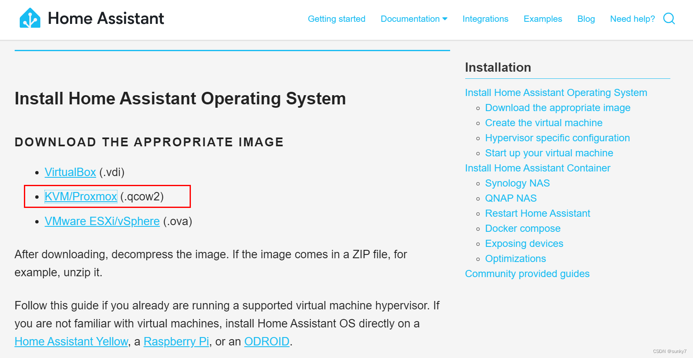

下载之后是个.xy压缩包，[解压缩](https://so.csdn.net/so/search?q=%E8%A7%A3%E5%8E%8B%E7%BC%A9\&spm=1001.2101.3001.7020)。

## 二、在Proxmox创建HomeAssistant虚拟机


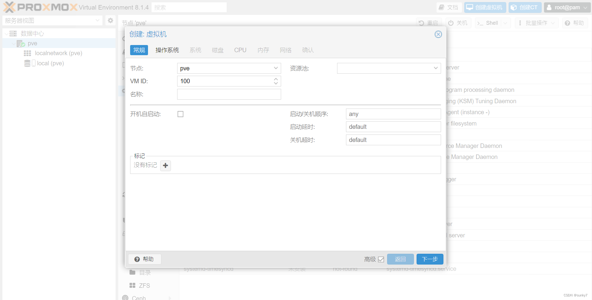

VM ID按照你的需求填写


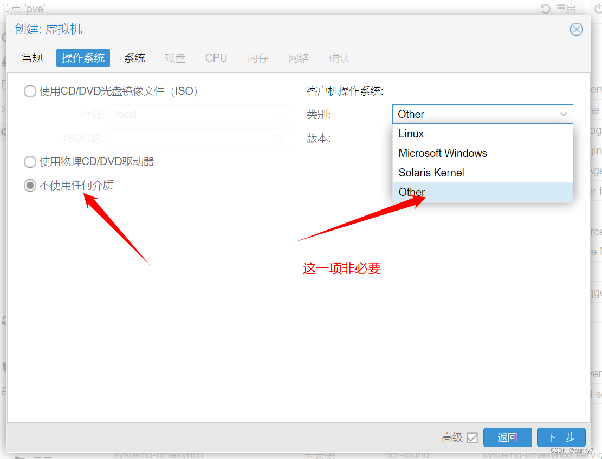

[操作系统](https://so.csdn.net/so/search?q=%E6%93%8D%E4%BD%9C%E7%B3%BB%E7%BB%9F\&spm=1001.2101.3001.7020)：不使用任何介质，版本选Other


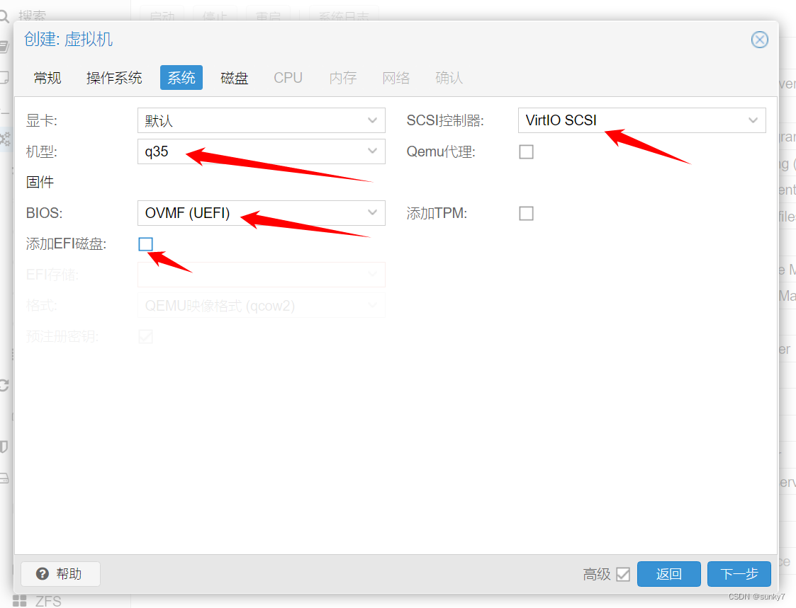

这一步选的内容较多，参考选择


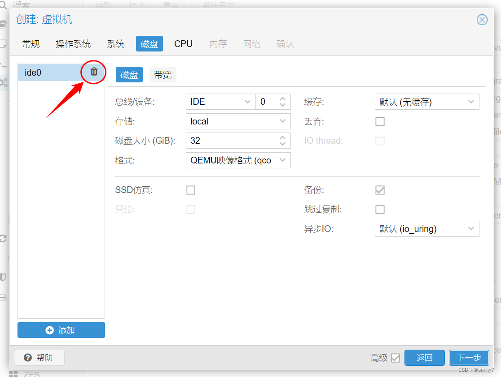

这一步磁盘直接删除


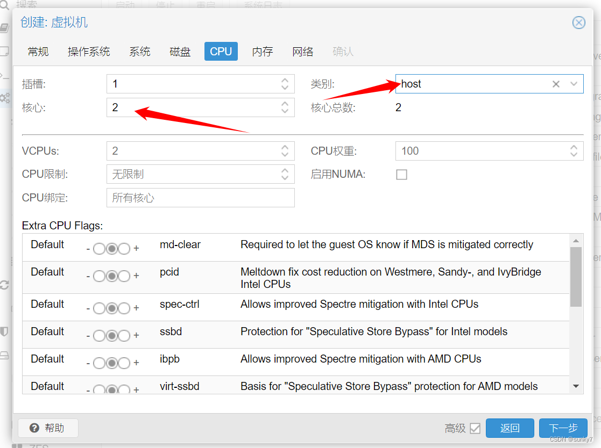

这一步核心建议选2，类别建议host（性能要高一些）


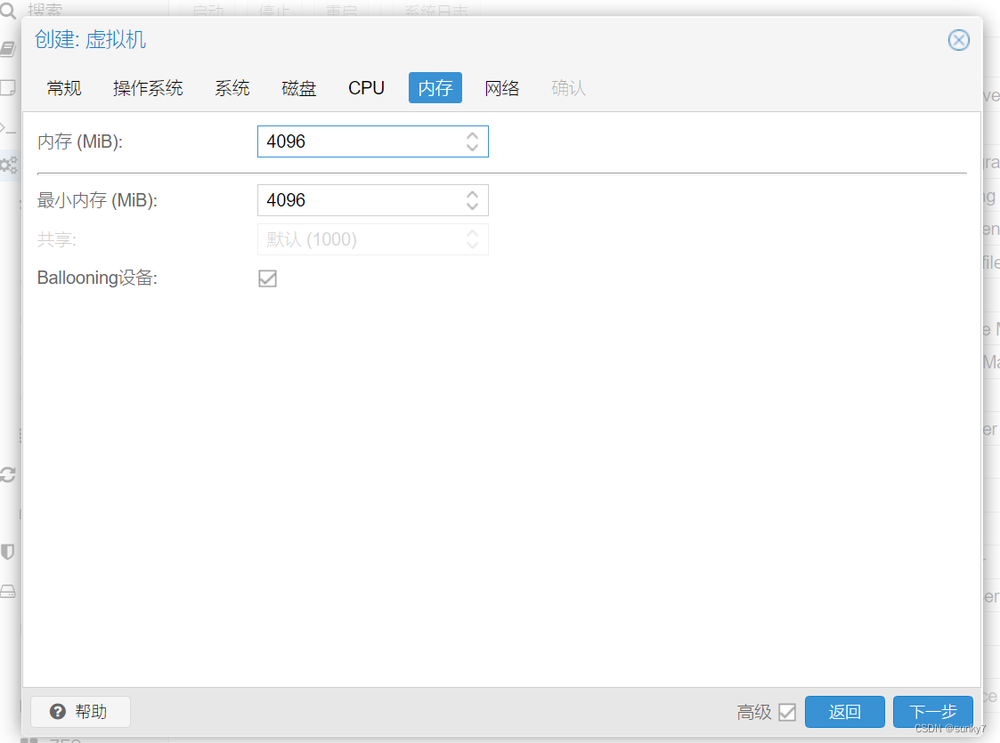

内存按需，我选了4096


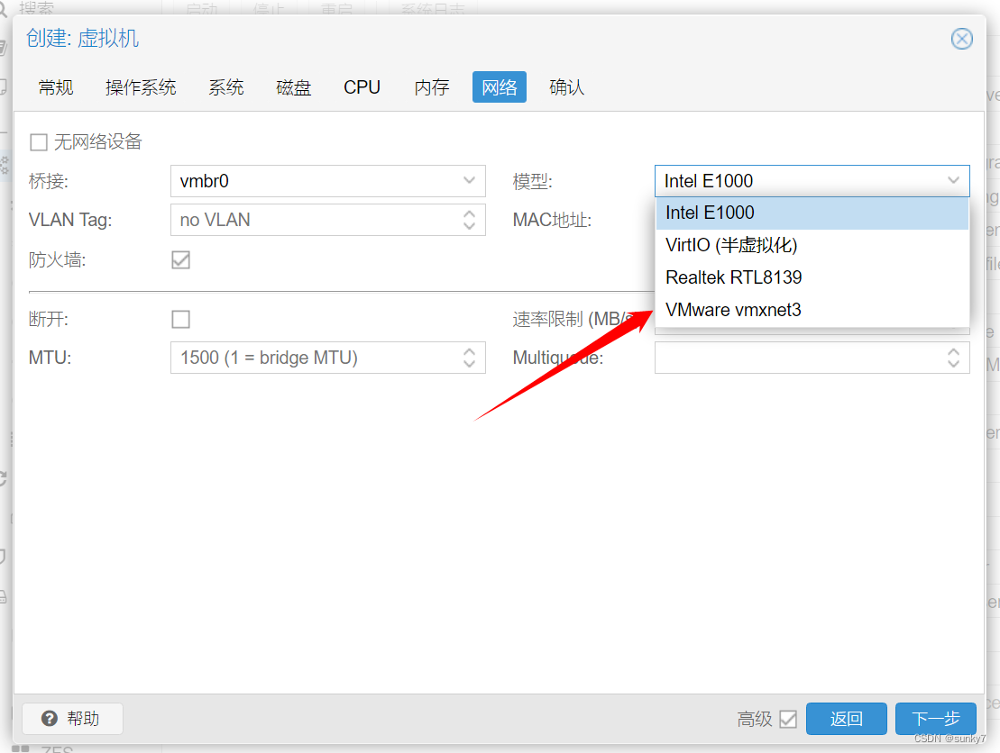

网卡除了RTL8139（模拟百兆卡），其他都可以，我选了 xmxnet3


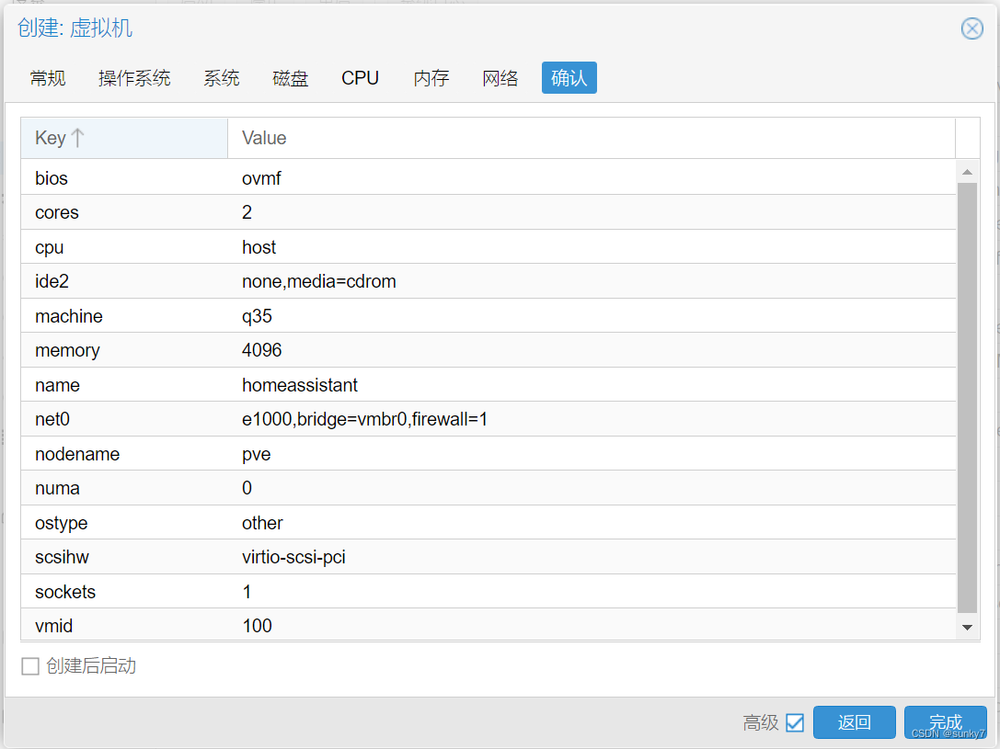

完成。

## 三、上传HomeAssistant镜像到ProxmoxVE服务器

上传镜像文件

使用winscp将解压好的(.qcow2)文件上传到服务器中，记住路径，我上传到/tmp


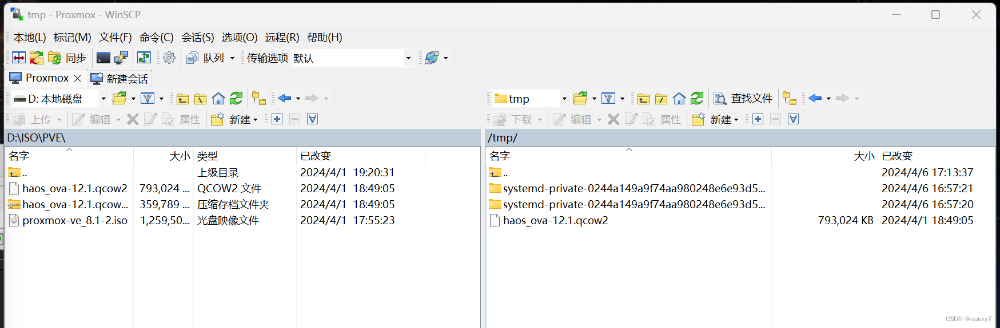

## 四、部署应用HomeAssistant模板

打开pve -> Shell


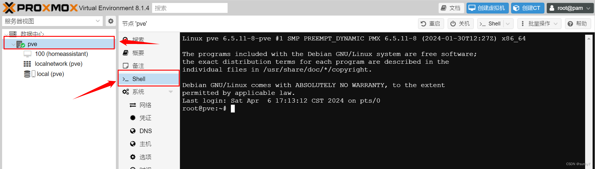

输入cd /tmp，cd到tmp目录，也就是刚刚虚拟机文件上传的文件夹

输入导入命令：

```
qm importdisk 100 haos_ova-15.2.qcow2 local --format=qcow2
```

其中：

100，改为你的虚拟机VM ID。

local，改为你的数据中心、存储、ID。


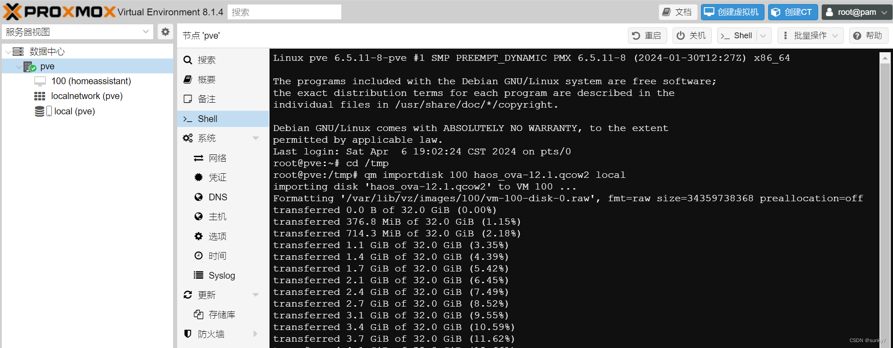

&#x20;出现：

```
Successfully imported disk as 'unused0:local:100/vm-100-disk-0.raw'
```

&#x20;表示成功。

打开数据中心、100、硬件，发现：未使用的磁盘0：


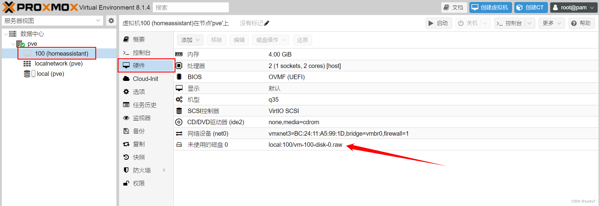

双击进行编辑，设备：SATA，添加。


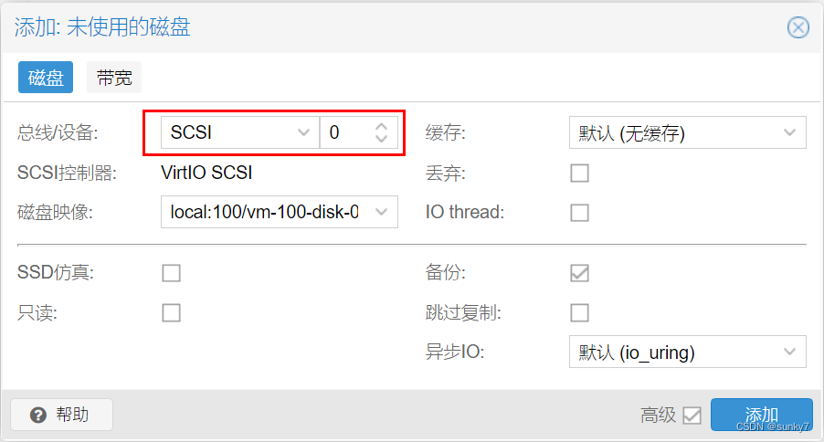

点击选项，设置启动选项：


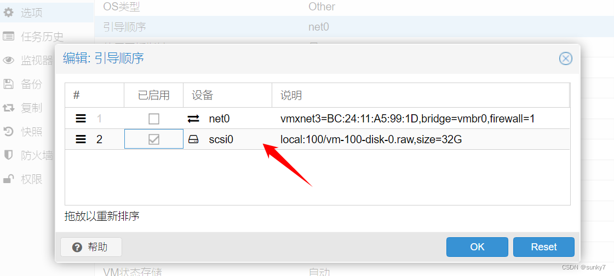

仅选我们导入的模板文件。

到此设置完成，再次检查重点位置：


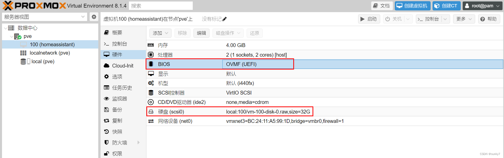

如此，点击启动，启动虚拟机。


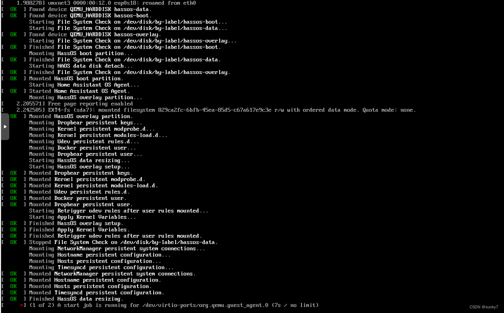

等待启动...，有些地方会比较慢，属于正常现象。


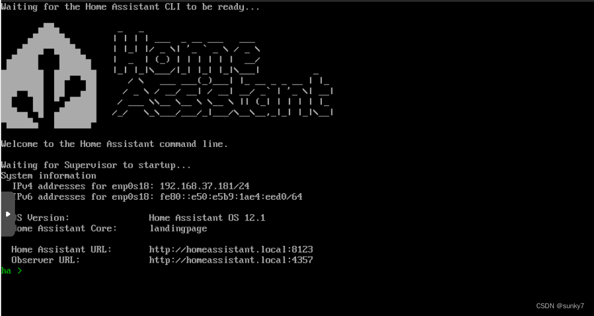


安装File editor：


[Lucky反代HA报400](http://192.168.5.100:3010/workspace/e24da8a2-e2c4-4e85-9821-67300b920bf5/5XLpJvfInZ3lGttG2mknN)

