# MOVIEPILOT V2


**学习与交流：MoviePilot 仅供个人学习与交流使用，禁止用于商业目的。**


**禁止视频内容：请勿将 MoviePilot 制作成视频内容，并在国内视频网站上传（涉及版权利益方）。**


**法律合规：严禁将 MoviePilot 用于任何违反法律法规的活动。**


**信息传播限制：本教程仅作为个人理解的补充，禁止在国内任何平台进行宣传和传播。**


**个人使用：请确保将 MoviePilot 用于个人学习和非商业化使用，不得以任何形式向第三方分发。**[ https://github.com/jxxghp/MoviePilot ](https://github.com/jxxghp/MoviePilot)


# 前言


**由于作者已宣布 MoviePilot v1 版本停止更新，后续的维护和功能升级将主要集中在 MoviePilot v2**


**因此对于已经搭建过 MoviePilot v1 的用户，如果想要部署 v2，需要注意：无法在原有基础上进行部署，需要另行创建独立的容器和新的文件夹**


## 部署前置条件(缺一不可）


* **部署V2raya**
* **部署Qbittorrent下载器**
* **部署EmbyServer媒体库**


**开始部署**


**认证方式（只有认证后才能使用某些功能）**


**由于2.0.7版本更新，可在变量位置不添加认证站点，直接进入mp后台设置即可**


**进去首页会出现在这个位置，我是已经设置过了**

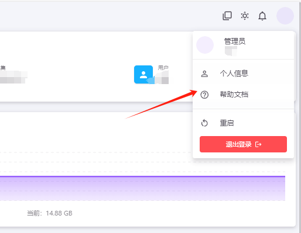

**选择你的站点，填写id跟秘钥即可**

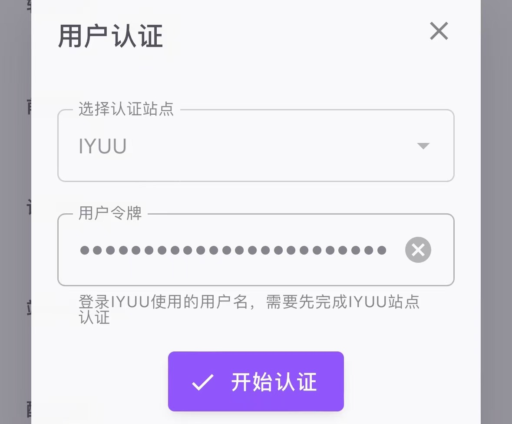


# MoviePilot认证站点支持


```yaml
配置AUTH_SITE后，需要根据下表配置对应站点的认证参数。
AUTH_SITE认证站点支持：iyuu/hhclub/audiences/hddolby/zmpt/freefarm/hdfans/wintersakura/leaves/ptba /icc2022/xingtan/ptvicomo/agsvpt/hdkyl/qingwa/discfan/haidan/rousi/sunny

站点名

AUTH_SITE

环境变量

IYUU

iyuu

IYUU_SIGN：IYUU登录令牌

憨憨

hhclub

HHCLUB_USERNAME：用户名
HHCLUB_PASSKEY：密钥

观众

audiences

AUDIENCES_UID：用户ID
AUDIENCES_PASSKEY：密钥

高清杜比

hddolby

HDDOLBY_ID：用户ID
HDDOLBY_PASSKEY：密钥

织梦

zmpt

ZMPT_UID：用户ID
ZMPT_PASSKEY：密钥

自由农场

freefarm

FREEFARM_UID：用户ID
FREEFARM_PASSKEY：密钥

红豆饭

hdfans

HDFANS_UID：用户ID
HDFANS_PASSKEY：密钥

冬樱

wintersakura

WINTERSAKURA_UID：用户ID
WINTERSAKURA_PASSKEY：密钥

红叶PT

leaves

LEAVES_UID：用户ID
LEAVES_PASSKEY：密钥

1PTBA

ptba

PTBA_UID：用户ID
PTBA_PASSKEY：密钥

冰淇淋

icc2022

ICC2022_UID：用户ID
ICC2022_PASSKEY：密钥

杏坛

xingtan

XINGTAN_UID：用户ID
XINGTAN_PASSKEY：密钥

象站

ptvicomo

PTVICOMO_UID：用户ID
PTVICOMO_PASSKEY：密钥

AGSVPT

agsvpt

AGSVPT_UID：用户ID
AGSVPT_PASSKEY：密钥

麒麟

hdkyl

HDKYL_UID：用户ID
HDKYL_PASSKEY：密钥

青蛙

qingwa

QINGWA_UID：用户ID
QINGWA_PASSKEY：密钥

蝶粉

discfan

DISCFAN_UID：用户ID
DISCFAN_PASSKEY：密钥

海胆之家

haidan

HAIDAN_ID：用户ID
HAIDAN_PASSKEY：密钥

Rousi

rousi

ROUSI_UID：用户ID
ROUSI_PASSKEY：密钥

Sunny

sunny

SUNNY_UID：用户ID
SUNNY_PASSKEY：密钥

```


**使用那个站点需要将AUTH\_SITE环境变量参数配置为站点名称，并在环境变量中填入对应的用户名+密钥。比如我用iyuu方式进行认证，我需要填两个环境变量：AUTH\_SITE=iyuu、IYUU\_SIGN=IYUU登录令牌**


**我用zmpt站方式认证需要填三个环境变量：AUTH\_SITE=zmpt、ZMPT\_UID=用户UID、ZMPT\_PASSKEY=密钥 ，其他PT站认证方式类似，在这不过多赘述了。**


**简单来说除了IYUU认证方式，其他站点认证都需要填入三个环境变量，分别是站点认证名称（不是站点名称）、用户UID（点个人中心获取）、密钥（一般在站点的控制面板获取）**


## 创建容器文件夹


**创建媒体文件夹（于emby、qb需要一致）**

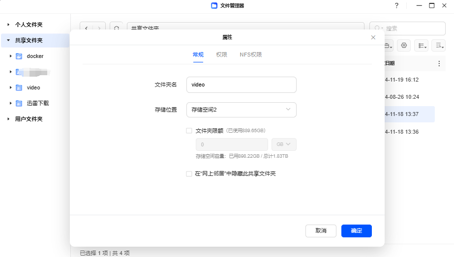


# Docker部署


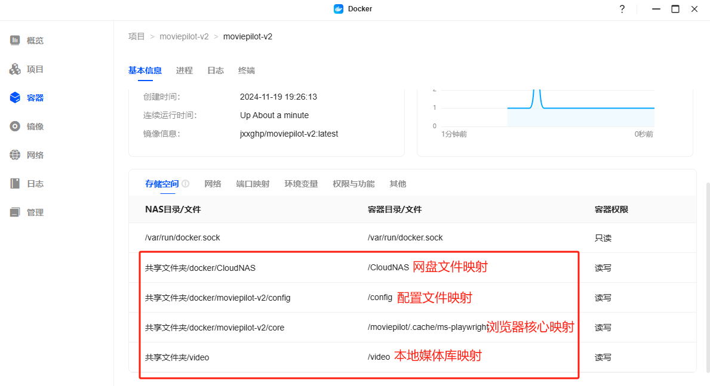

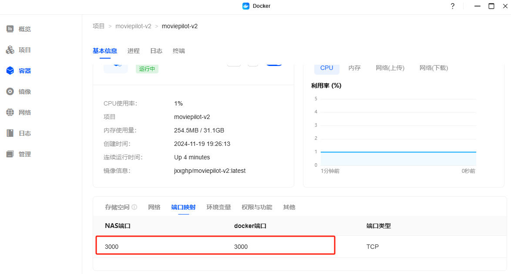


## 注意⚠️


**Docker环境变量需要注意（一下几个带❗均为需要设置的变量，否则无法进行）**


* **MOVIEPILOT\_AUTO\_UPDATE=release # 重启更新设置，默认release，需要更新就改成true**
* **❗PROXY\_HOST=****[http://IP:端口](http://IP:%E7%AB%AF%E5%8F%A3)****&#x20;# HTTP 网络代理**
* **❗AUTH\_SITE=iyuu # 设置认证站点名称为 iyuu，其他认证方式注意看目录进行修改**
* **❗IYUU\_SIGN=xxxx # 设置 IYUU密钥，其他认证方式注意看目录进行修改**
* **❗SUPERUSER=admin' # 设置超级管理员账户名为 admin，可自定义**
* **❗API\_TOKEN： API密钥，V1版本默认为moviepilot，V2版本需要配置为大于等于16个字符的复杂字符串 （如配置不符合要求将会强制重新生成，可在后台日志、env配置文件或系统设定中查看最新的值） 。在媒体服务器Webhook、微信回调等地址配置中需要加上?token=该值。**

  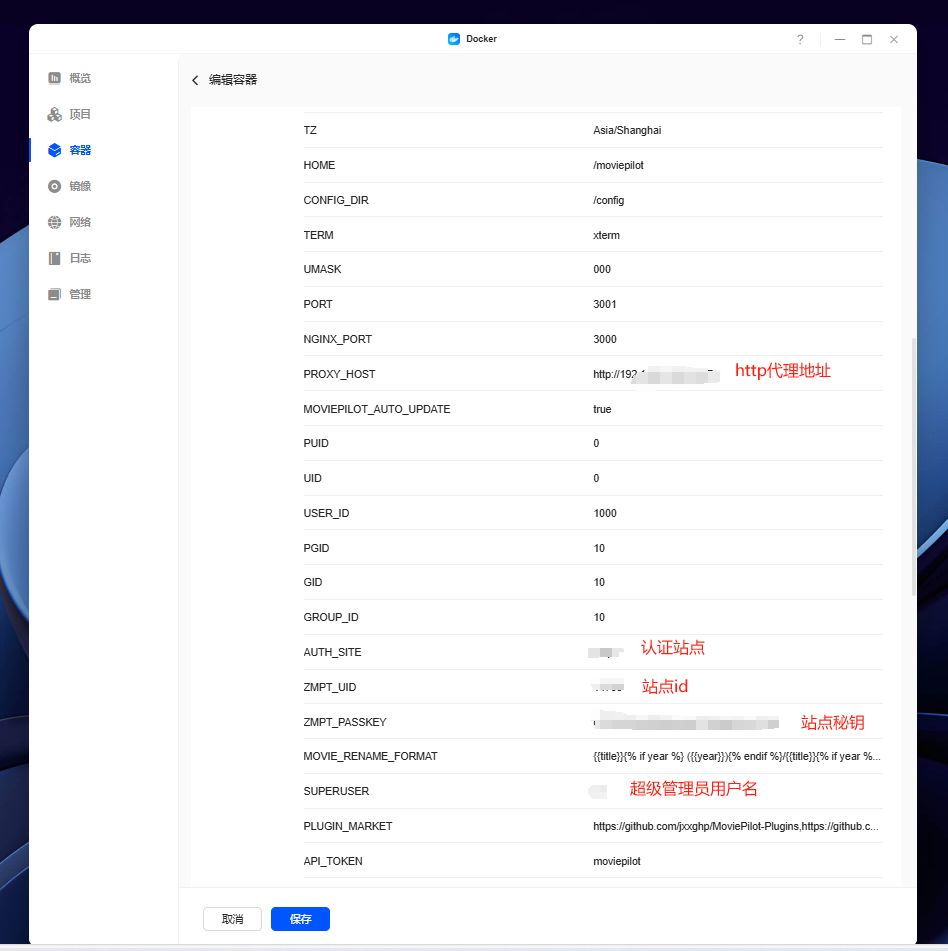


# Docker Compose部署


## Docker Compose 配置文件


```yaml
services:
 moviepilot:
 stdin_open: true # 保持容器的标准输入打开，方便交互
 tty: true # 分配伪终端，便于调试和交互式运行
 container_name: moviepilot-v2 # 设置容器名称为 moviepilot-v2
 hostname: moviepilot-v2 # 设置容器的主机名为 moviepilot-v2
 network_mode: bridge # 使用Docker默认的桥接网络
 ports:
 - "3002:3000" # 将容器的端口 3000 映射到宿主机的 3002 端口
 volumes:
 - '/volume2/video:/video' # 挂载本地媒体库目录
 - '/volume1/docker/CloudNAS:/CloudNAS' # 挂载云盘目录
 - '/volume1/docker/moviepilot-v2/config:/config' # 持久化存储配置文件
 - '/volume1/docker/moviepilot-v2/core:/moviepilot/.cache/ms-playwright' # 持久化缓存数据
 - '/var/run/docker.sock:/var/run/docker.sock:ro' # 允许容器访问宿主机的 Docker socket，通常用于Docker-in-Docker
 environment:
 - 'NGINX_PORT=3000' # 设置 Nginx 使用的端口为 3000
 - 'PORT=3001' # 应用内部的端口号
 - 'PUID=0' # 设置用户 ID 为 0（root 用户）
 - 'PGID=0' # 设置组 ID 为 0（root 组）
 - 'UMASK=000' # 设置文件权限掩码为 000，意味着创建的文件会有最大权限
 - 'TZ=Asia/Shanghai' # 设置时区为上海
 - 'AUTH_SITE=iyuu' # 设置认证站点名称为 iyuu，其他认证方式注意看目录进行修改
 - 'IYUU_SIGN=xxxx' # 设置 IYUU密钥，其他认证方式注意看目录进行修改
 - 'SUPERUSER=admin' # 设置超级管理员账户名为 admin，可自定义
 - 'API_TOKEN=自定义' # 设置 API Token，用于身份验证
 - 'MOVIEPILOT_AUTO_UPDATE=release' # 自动更新设置
 - 'PROXY_HOST=http://IP:端口' # HTTP 网络代理
 restart: always # 如果容器崩溃或停止，始终重新启动
 image: jxxghp/moviepilot-v2:latest # 使用 jxxghp 的 moviepilot-v2 镜像
# 注意：容器将共享宿主机的网络堆栈，并且暴露的端口会与宿主机端口直接绑定。


```


**绿联云-Docker-项目-创建项目-输入名称，填写compose命令，点击立即部署即可**

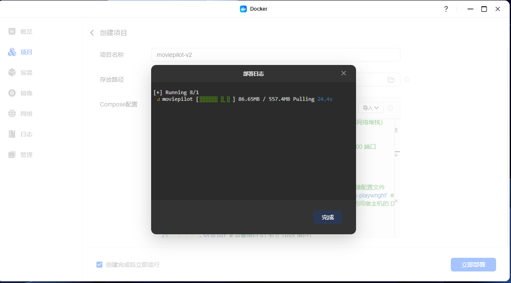

**第一次安装，默认密码会出现在日志**

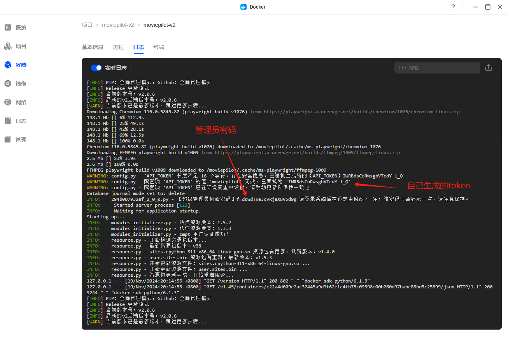

**注意：初始管理员密码只会出现一次，如果不显示或者忘记了密码，需要去配置文件夹目录删除名为：user.db的文件，重启后即可重新在日志获取初始密码**

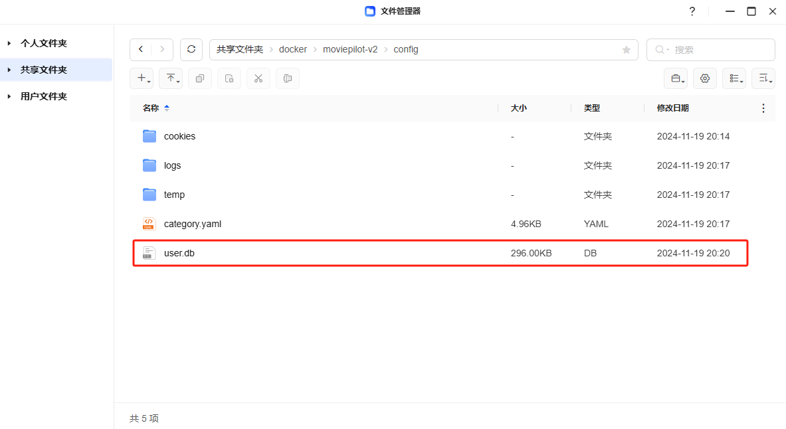

**使用方法浏览器访问http://设备IP:3000**

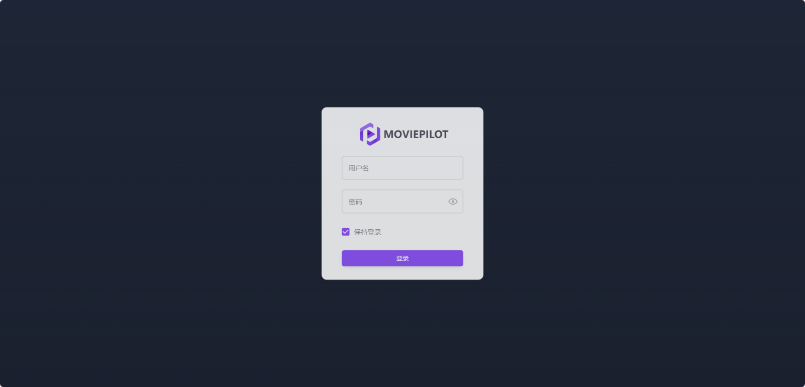

**进去第一步，先把密码改了**

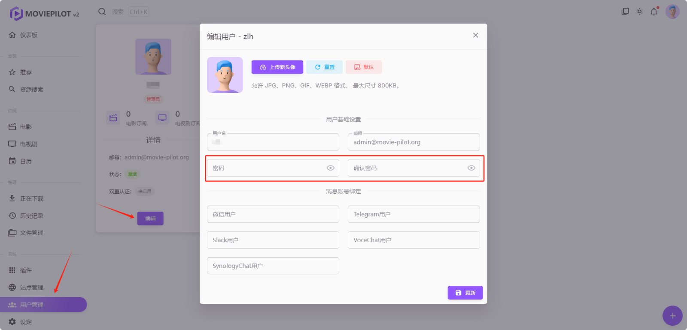


## **获取Github Token**


[ https://github.com/settings/personal-access-tokens ](https://github.com/settings/personal-access-tokens)


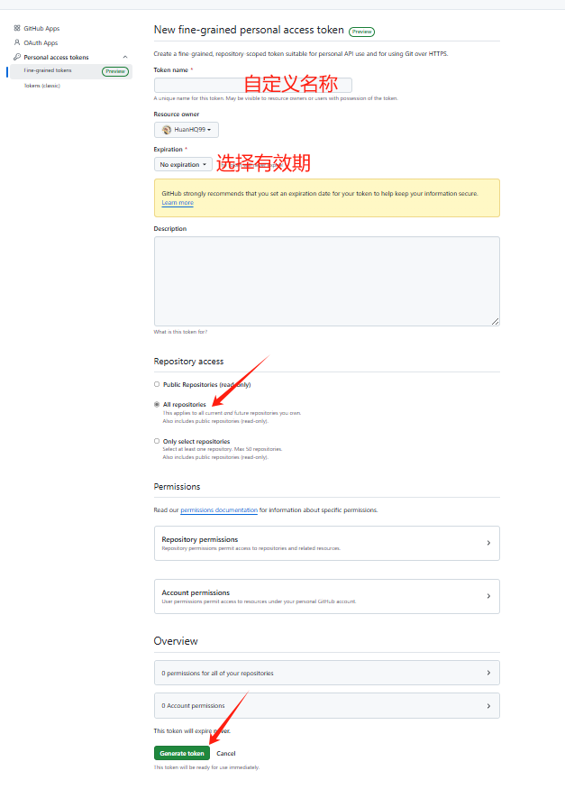

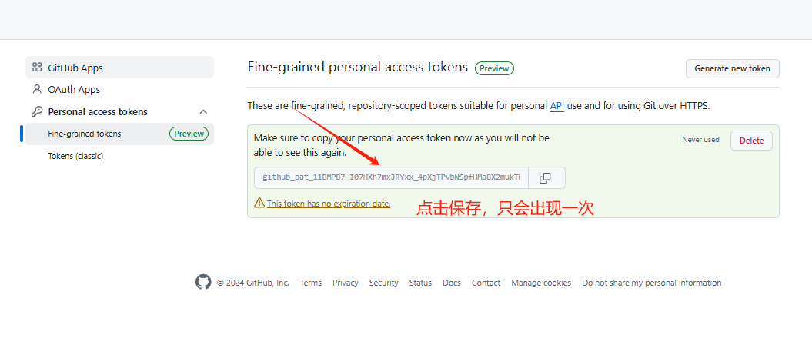


## 自定义主题风格


**效果**

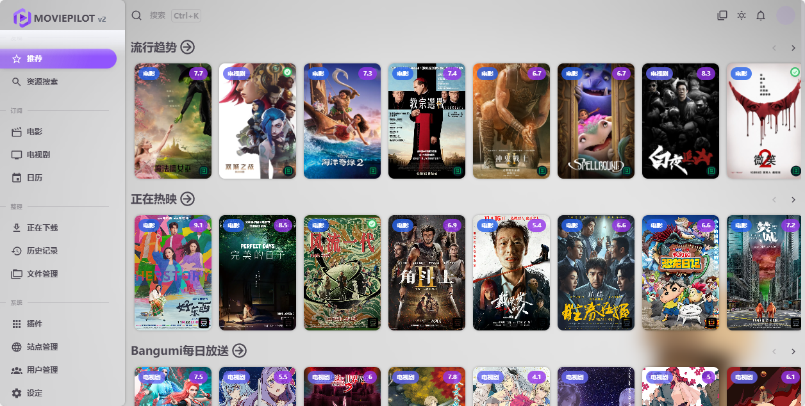

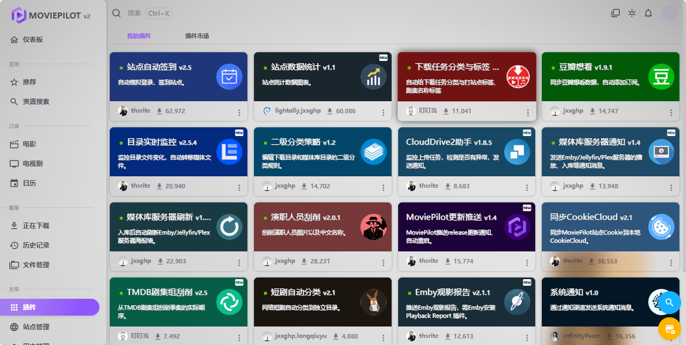


### c**ss代码**


## Docker Compose 配置文件


```yaml
html {
 background-image: url(https://gd-hbimg.huaban.com/54f5e319f4dde7bf2460c66e476e388cfbf6560540e2-YvdvvP_fw1200);
 background-attachment: fixed;
 background-size: cover;
 height: 100%;
}

body, #app, .v-application {
 height: 100% !important;
 min-height: initial !important;
 background: none !important;
 backdrop-filter: blur(20px); /* 增加背景模糊效果 */
 transition: transform 0.5s ease, box-shadow 0.5s ease; /* 设定过渡效果 */
 box-shadow: 0 0 5px rgba(0,0,0,0.3); /* 添加阴影效果 */
 border-radius: 10px; /* 设置圆角 */
 animation: bodyFadeIn 1s; /* 应用淡入动画 */
}
/* 设置 body, #app 和 .v-application 的样式，包括高度、背景、模糊效果、过渡效果、阴影、圆角和动画 */

@keyframes bodyFadeIn {
 from { opacity: 0; }
 to { opacity: 1; }
}
/* 定义一个淡入动画 */

.layout-wrapper {
 height: 100%;
 overflow: auto;
}
::-webkit-scrollbar-thumb {
 background: rgba(var(--v-theme-perfect-scrollbar-thumb),0.8) !important;
 transition: background 0.3s ease-in-out;
}
/* 自定义滚动条滑块样式及其过渡效果 */

::-webkit-scrollbar-thumb:hover {
 background: #a1a1a1bb !important;
}
/* 设置滚动条滑块悬停时的样式 */
* {
 font-weight: bold; /* 所有文字加粗 */
}
/* 设置所有文字加粗 */

.v-application, .v-card--variant-elevated, .v-list {
 background: none !important;
 transition: transform 0.3s ease-in-out, box-shadow 0.3s ease-in-out;
 border-radius: 10px;
}
/* 设置 .v-application 和 .v-card--variant-elevated .v-list 的样式，包括背景、过渡效果、阴影和圆角 */

.layout-nav-type-vertical .layout-vertical-nav {
 background: rgba(var(--v-theme-background),0.3);
 transition: transform 0.3s ease-in-out, box-shadow 0.3s ease-in-out;
 box-shadow: 0 0 5px rgba(0,0,0,0.3);
 border-radius: 10px;
}
/* 设置垂直导航栏的背景、过渡效果、阴影和圆角 */

.v-card, .v-field--variant-solo, .v-field--variant-solo-filled, .v-field--variant-solo-inverted {
 background: rgba(var(--v-theme-background),0.3);
 transition: transform 0.3s ease-in-out, box-shadow 0.3s ease-in-out;
 box-shadow: 0 0 5px rgba(0,0,0,0.3);
 border-radius: 10px;
 transition: all 0.3s ease-in-out;
}
/* 设置卡片、列表项和表单域的样式，包括背景、过渡效果、阴影和圆角 */

.v-card:hover, .v-field--variant-solo:hover, .v-field--variant-solo-filled:hover, .v-field--variant-solo-inverted:hover {
 transform: scale(1.01);
 box-shadow: 0 0 25px rgba(0,0,0,0.8);
}
/* 设置卡片、列表项和表单域的悬停效果，包括缩放和增强阴影 */


.v-dialog .v-card {
 background: rgba(var(--v-theme-background),0.5);
 transition: transform 0.3s ease-in-out, box-shadow 0.3s ease-in-out;
 box-shadow: 0 0 5px rgba(0,0,0,0.3);
 border-radius: 10px;
}
/* 设置对话框中卡片的样式，包括背景、过渡效果、阴影和圆角 */

.v-toolbar {
 background: rgba(var(--v-table-header-background),0.3) !important;
 transition: transform 0.3s ease-in-out, box-shadow 0.3s ease-in-out;
 box-shadow: 0 0 5px rgba(0,0,0,0.3);
 border-radius: 10px;
}
/* 设置工具栏的背景、过渡效果、阴影和圆角 */

.v-application .fc {
 background: rgba(var(--v-theme-surface),0.3) !important;
 transition: transform 0.3s ease-in-out, box-shadow 0.3s ease-in-out;
 box-shadow: 0 0 5px rgba(0,0,0,0.3);
 border-radius: 10px;
}
/* 设置列表和应用程序表面的背景、过渡效果、阴影和圆角 */

.v-application .fc .fc-scrollgrid-section-sticky > * {
 background: rgba(var(--v-theme-surface),0.2) !important;
 transition: transform 0.3s ease-in-out, box-shadow 0.3s ease-in-out;
 box-shadow: 0 0 5px rgba(0,0,0,0.3);
 border-radius: 10px;
}
/* 设置滚动网格粘性部分的背景、过渡效果、阴影和圆角 */

.navbar-blur.layout-navbar .navbar-content-container, .v-table {
 background: none !important;
 /* transition: transform 0.3s ease-in-out, box-shadow 0.3s ease-in-out; */
 /* box-shadow: 0 0 5px rgba(0,0,0,0.3); */
 /* border-radius: 10px; */
}
/* 设置导航栏和表格的背景、过渡效果、阴影和圆角 */

.v-data-table th, .v-data-table td {
 background: rgba(var(--v-theme-surface),0.4) !important;
 transition: transform 0.3s ease-in-out, box-shadow 0.3s ease-in-out;
 box-shadow: 0 0 5px rgba(0,0,0,0.3);
 border-radius: 10px;
}
/* 设置数据表格单元格的背景、过渡效果、阴影和圆角 */

.v-skeleton-loader {
 background: rgba(var(--v-theme-surface),0.2) !important;
 transition: transform 0.3s ease-in-out, box-shadow 0.3s ease-in-out;
 box-shadow: 0 0 5px rgba(0,0,0,0.3);
 border-radius: 10px;
}
/* 设置骨架加载器的背景、过渡效果、阴影和圆角 */

.bg-primary {
 background-color: rgba(0, 0, 0, 0.6) !important;
 transition: transform 0.3s ease-in-out, box-shadow 0.3s ease-in-out;
 box-shadow: 0 0 5px rgba(0,0,0,0.3);
 border-radius: 10px;
}
/* 设置主要背景颜色、过渡效果、阴影和圆角 */


@media (max-width: 600px) {
 body, #app, .v-application {
 backdrop-filter: blur(4px);
 }

 .v-card, .v-field--variant-solo, .v-field--variant-solo-filled, .v-field--variant-solo-inverted {
 box-shadow: 0 0 3px rgba(0,0,0,0.3);
 }

 .v-card:hover, .v-field--variant-solo:hover, .v-field--variant-solo-filled:hover, .v-field--variant-solo-inverted:hover {
 transform: scale(1.01);
 box-shadow: 0 0 20px rgba(0,0,0,0.8);
 }
}
/* 响应式设计，针对宽度小于600px的设备，设置不同的模糊效果和阴影 */


```


## 基本设置


### 设定


#### 系统


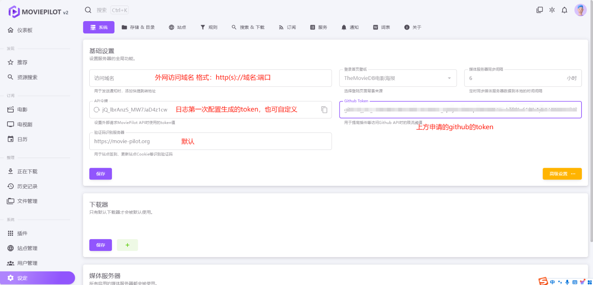


##### 下载器设置


**选择你自己使用的下载器，我这里使用的是QB**

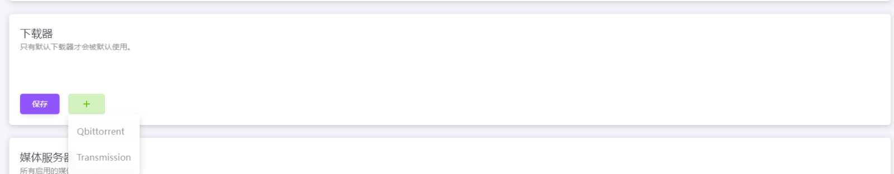

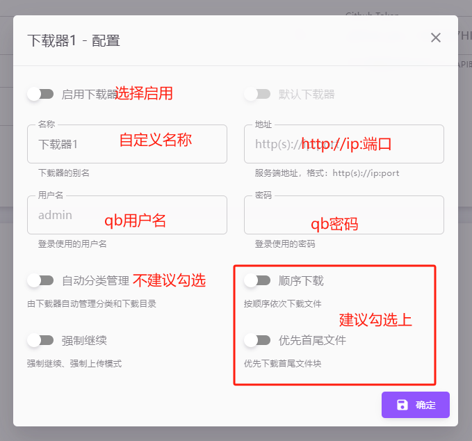


##### 媒体服务器设置


**我这里使用的是Emby**

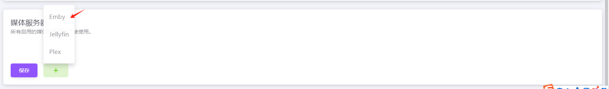

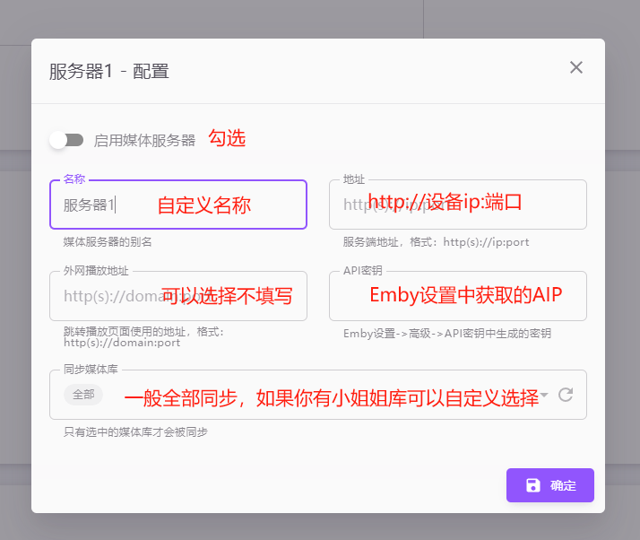


#### 存储 & 目录


**这次V2的改动相对来说方便一点，因为上下对应同一个类型的媒体库，配置的话更顺**


**由于我使用的是网盘搭配，大家这个媒体库目录可以根据自己的需求来设置**

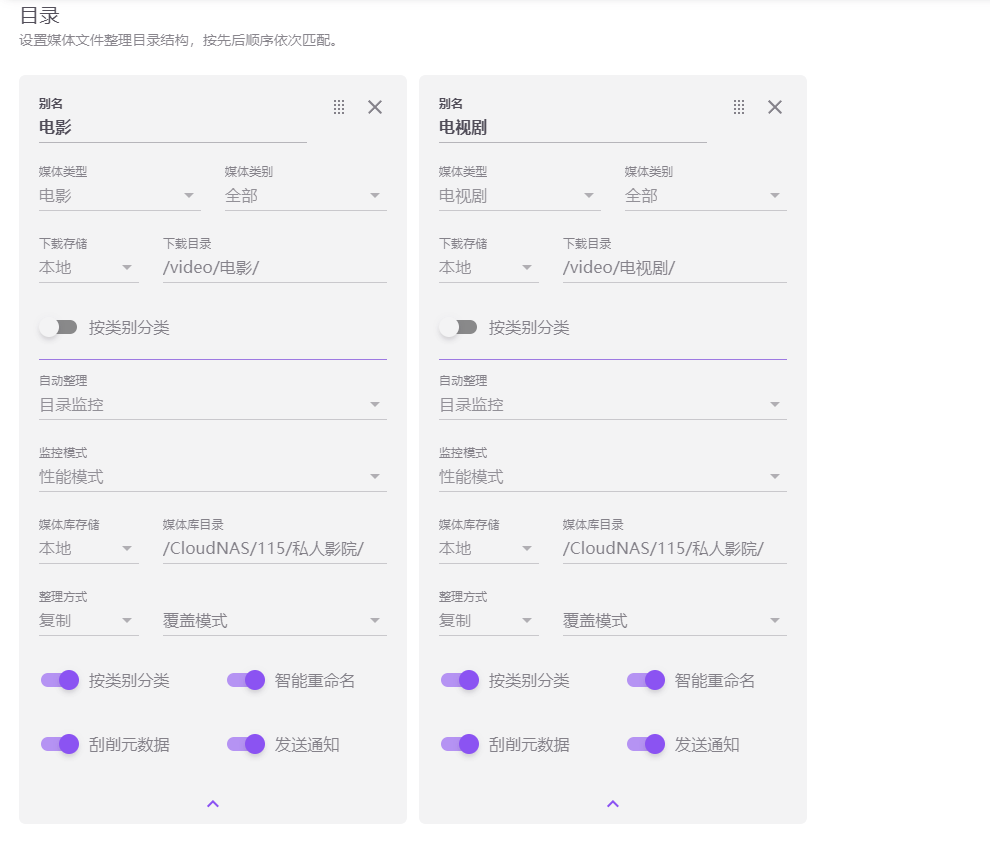

**懒人设置二级分类策略（参考我这个分类会省不少事）我这个分类会没有儿童国漫日番，只有一个动漫**


```yaml
####### 配置说明 #######
# 1. 该配置文件用于配置电影和电视剧的分类策略，配置后程序会按照配置的分类策略名称进行分类，配置文件采用yaml格式，需要严格附合语法规则
# 2. 配置文件中的一级分类名称：`movie`、`tv` 为固定名称不可修改，二级名称同时也是目录名称，会按先后顺序匹配，匹配后程序会按这个名称建立二级目录
# 3. 支持的分类条件：
# `original_language` 语种，具体含义参考下方字典
# `production_countries` 国家或地区（电影）、`origin_country` 国家或地区（电视剧），具体含义参考下方字典
# `genre_ids` 内容类型，具体含义参考下方字典
# themoviedb 详情API返回的其它一级字段
# 4. 配置多项条件时需要同时满足，一个条件需要匹配多个值是使用`,`分隔

# 配置电影的分类策略
movie:
 # 分类名同时也是目录名
 动画电影:
 # 匹配 genre_ids 内容类型，16是动漫
 genre_ids: '16'
 华语电影:
 # 匹配语种
 original_language: 'zh,cn,bo,za'
 # 未匹配以上条件时，分类为外语电影
 外语电影:

# 配置电视剧的分类策略
tv:
 # 分类名同时也是目录名
 动漫:
 # 匹配 genre_ids 内容类型，16是动漫
 genre_ids: '16'
 纪录片:
 # 匹配 genre_ids 内容类型，99是纪录片
 genre_ids: '99'
 综艺:
 # 匹配 genre_ids 内容类型，10764 10767都是综艺
 genre_ids: '10764,10767'
 国产剧:
 # 匹配 origin_country 国家，CN是中国大陆，TW是中国台湾，HK是中国香港
 origin_country: 'CN,TW,HK'
 欧美剧:
 # 匹配 origin_country 国家，主要欧美国家列表
 origin_country: 'US,FR,GB,DE,ES,IT,NL,PT,RU,UK'
 日韩剧:
 # 匹配 origin_country 国家，主要亚洲国家列表
 origin_country: 'JP,KP,KR,TH,IN,SG'
 # 未匹配以上分类，则命名为未分类
 未分类:

## genre_ids 内容类型 字典，注意部分中英文是不一样的
# 28 Action
# 12 Adventure
# 16 Animation
# 35 Comedy
# 80 Crime
# 99 Documentary
# 18 Drama
# 10751 Family
# 14 Fantasy
# 36 History
# 27 Horror
# 10402 Music
# 9648 Mystery
# 10749 Romance
# 878 Science Fiction
# 10770 TV Movie
# 53 Thriller
# 10752 War
# 37 Western
# 28 动作
# 12 冒险
# 16 动画
# 35 喜剧
# 80 犯罪
# 99 纪录
# 18 剧情
# 10751 家庭
# 14 奇幻
# 36 历史
# 27 恐怖
# 10402 音乐
# 9648 悬疑
# 10749 爱情
# 878 科幻
# 10770 电视电影
# 53 惊悚
# 10752 战争
# 37 西部

## original_language 语种 字典
# af 南非语
# ar 阿拉伯语
# az 阿塞拜疆语
# be 比利时语
# bg 保加利亚语
# ca 加泰隆语
# cs 捷克语
# cy 威尔士语
# da 丹麦语
# de 德语
# dv 第维埃语
# el 希腊语
# en 英语
# eo 世界语
# es 西班牙语
# et 爱沙尼亚语
# eu 巴士克语
# fa 法斯语
# fi 芬兰语
# fo 法罗语
# fr 法语
# gl 加里西亚语
# gu 古吉拉特语
# he 希伯来语
# hi 印地语
# hr 克罗地亚语
# hu 匈牙利语
# hy 亚美尼亚语
# id 印度尼西亚语
# is 冰岛语
# it 意大利语
# ja 日语
# ka 格鲁吉亚语
# kk 哈萨克语
# kn 卡纳拉语
# ko 朝鲜语
# kok 孔卡尼语
# ky 吉尔吉斯语
# lt 立陶宛语
# lv 拉脱维亚语
# mi 毛利语
# mk 马其顿语
# mn 蒙古语
# mr 马拉地语
# ms 马来语
# mt 马耳他语
# nb 挪威语(伯克梅尔)
# nl 荷兰语
# ns 北梭托语
# pa 旁遮普语
# pl 波兰语
# pt 葡萄牙语
# qu 克丘亚语
# ro 罗马尼亚语
# ru 俄语
# sa 梵文
# se 北萨摩斯语
# sk 斯洛伐克语
# sl 斯洛文尼亚语
# sq 阿尔巴尼亚语
# sv 瑞典语
# sw 斯瓦希里语
# syr 叙利亚语
# ta 泰米尔语
# te 泰卢固语
# th 泰语
# tl 塔加路语
# tn 茨瓦纳语
# tr 土耳其语
# ts 宗加语
# tt 鞑靼语
# uk 乌克兰语
# ur 乌都语
# uz 乌兹别克语
# vi 越南语
# xh 班图语
# zh 中文
# cn 中文
# zu 祖鲁语

## origin_country/production_countries 国家地区 字典
# AR 阿根廷
# AU 澳大利亚
# BE 比利时
# BR 巴西
# CA 加拿大
# CH 瑞士
# CL 智利
# CO 哥伦比亚
# CZ 捷克
# DE 德国
# DK 丹麦
# EG 埃及
# ES 西班牙
# FR 法国
# GR 希腊
# HK 香港
# IL 以色列
# IN 印度
# IQ 伊拉克
# IR 伊朗
# IT 意大利
# JP 日本
# MM 缅甸
# MO 澳门
# MX 墨西哥
# MY 马来西亚
# NL 荷兰
# NO 挪威
# PH 菲律宾
# PK 巴基斯坦
# PL 波兰
# RU 俄罗斯
# SE 瑞典
# SG 新加坡
# TH 泰国
# TR 土耳其
# US 美国
# VN 越南
# CN 中国 内地
# GB 英国
# TW 中国台湾
# NZ 新西兰
# SA 沙特阿拉伯
# LA 老挝
# KP 朝鲜 北朝鲜
# KR 韩国 南朝鲜
# PT 葡萄牙
# MN 蒙古国 蒙古

```


##### 文件自动整理选项


**MoviePilot V2版本支持按目录设定是否通过下载器监控整理或者目录监控整理，内建集成了目录监控功能，无需安装第三方插件。**


**下载器监控自动整理间隔为5分钟，设定中所有启用的下载器且设定了对应目录时都会自动整理。**


**目录监控为实时。但请避免对网盘目录使用目录监控，容易触发大量API请求导致被流控**


##### 整理方式选项


**根据磁盘结构、空间大小、保种需要等综合决定使用哪种文件整理方式，并且MP也支持直接整理到网盘中。**


**复制：复制一份副本，多占用一份空间。（想要做种，又想整理到网盘选择该选项即可）**


**移动：移动文件存储位置，会影响原文件做种。**


**硬链接：一份文件生成多个文件入口，但只占用一份存储空间，只有所有入口都删除后才能释放文件占用空间；可以修改硬链接后的文件名但不会影响原文件做种（不能修改文件内容）；要求在同一磁盘/存储空间/映射路径下才能硬链接。**


**软链接：类似于快捷方式，原文件删除后软链接即会失效；使用软链接时的原文件路径需要与生成软链接时的原文件路径保持一致，否则无法使用，也就是在docker环境下，映射前后的目录路径需要一致。**


##### 覆盖模式选项


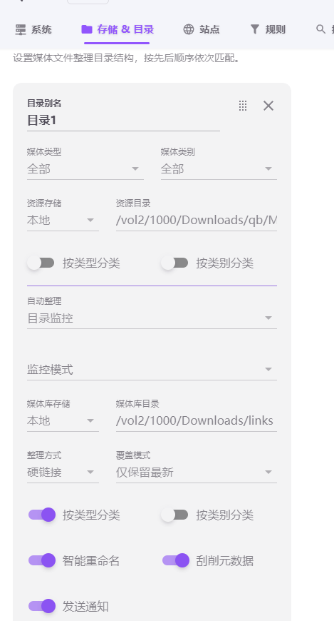

**从不：当媒体库中存在同名文件时中断整理，历史记录中将产生错误的整理记录。**


**总是覆盖：直接使用下载的文件覆盖媒体库中的同名文件。**


**按大小覆盖：当下载文件比媒体库中已有文件更大时覆盖已有文件，否则中断整理并在历史记录中将产生错误的整理记录。**


**仅保留最新版本：同一个电影或者电视剧剧集，删除媒体库中的其它版本文件（包括文件名不一致的），仅保留下载整理的最新版本。**


**下载目录和媒体库目录均支持一级、二级分类：**


**一级分类为媒体类型，固定分为：电影、电视剧**

**二级分类为媒体类别，通过分类策略结合TheMovieDb的元数据确定分类**


**电影**

**电视剧**

**媒体类型和媒体类别为使用这个目录的判定条件，按媒体的元数据进行匹配，全部代表匹配通过。**


**简单来说在V2版本中，无论是下载目录还是媒体目录都是：**


**开启：按类型分类，即会自动生成一级目录：电影、电视剧。**


**开启：按类别分类，即会自动生成电影、电视剧的二级目录。二级分类策略修改则需要在插件：二级分类策略，进行修改。**


**实现原理**


**举例，我现在路径设置，（刮削目录）/video/links下载目录/video/link**


**先是QB、TR等下载器下载的内容—/video/link—通过目录监控整理、刮削分类—/video/links，从而让你的媒体库读取已经刮削好的媒体目录，生成海报墙**


##### 整理刮削


###### 电影重命名格式


```
{{title}} ({{year}})/{{title}} ({{year}}) - {{videoFormat}}.{{videoCodec}}.{{audioCodec}}.{{customization}}.{{effect}}.{{releaseGroup}}{{fileExt}}


```


###### 电影支持的配置项


```yaml
title： TMDB/豆瓣中的标题
en_title： TMDB中的英文标题 （暂不支持豆瓣）
original_title： TMDB/豆瓣中的原语种标题
name： 从文件名中识别的名称（同时存在中英文时，优先使用中文）
en_name：从文件名中识别的英文名称（可能为空）
original_name： 原文件名（包括文件外缀）
year： 年份
resourceType：资源类型
effect：特效
edition： 版本（资源类型+特效）
videoFormat： 分辨率
releaseGroup： 制作组/字幕组
customization： 自定义占位符
videoCodec： 视频编码
audioCodec： 音频编码
tmdbid： TMDB ID（非TMDB识别源时为空）
imdbid： IMDB ID（可能为空）
doubanid：豆瓣ID（非豆瓣识别源时为空）
part：段/节
fileExt：文件扩展名
customization：自定义占位符


```


###### 电视剧重命名格式


```
{{title}} ({{year}})/Season {{season}}/{{title}} {{season_episode}} {{videoFormat}}.{{customization}}.{{releaseGroup}}{{fileExt}}


```


###### 电视剧额外支持的配置项


```yaml
season： 季号
season_year：季年份
episode： 集号
season_episode： 季集 SxxExx
episode_title： 集标题


```


# 站点


## Cookiecloud部署


### Docker Compose 配置文件


```yaml
services: # 定义服务
 cookiecloud: # 服务名称
 image: easychen/cookiecloud:latest # 指定 Docker 镜像
 network_mode: bridge # 使用Docker默认的桥接网络
 ports:
 - "8088:8088" # 将容器的端口 3000 映射到宿主机的 3002 端口


```


### Docker 部署


**该容器不需要任何文件夹映射，环境变量修改，只是以服务端形式运行在docker上，所有默认即可。**


### Cookiecloud使用方法


**这个是将浏览器中的PT站cookie同步到本地的容器，MP可以通过这个插件同步站点，拥有多站点的可以使用这个容器，会自动同步。**


* **第一步：浏览器访问http://设备ip:8088，出现以上字样即代表部署成功。（仅限在同一个局域网的情况下这么填，如果在外网同步话填的内容是不一样的，在这不过多赘述了）**
* **第二步：在谷歌、edge等浏览器下载上安装插件，进入拓展程序（每个浏览器进入方式不一样）具体可以百度使用方法不具体展开了。在拓展商店搜索：CookieCloud。同步域名关键词填入你想同步的PT站点域名，然后先测试一下，看看能不能通，再点手动同步，最后点保存。**&#x7247;**手动执行一下同步站点功能即可可以看到站点管理已经同步完成，没有同步成功的可以点击右下角加好自定义添加站点打开站点网页，F12调出开发者模式，一般站点cookie值在network下的index.php下，复制值填入即可。PS：馒头站点添加方式：只需要填写网址+请求头+令牌即可**

  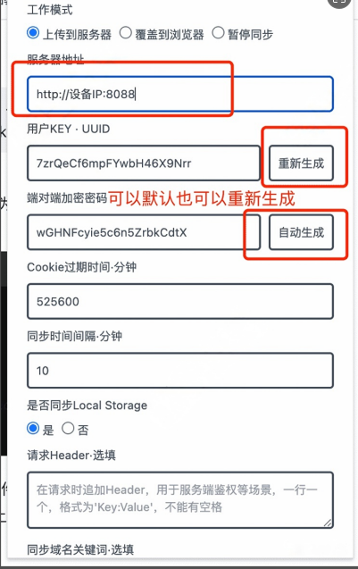

  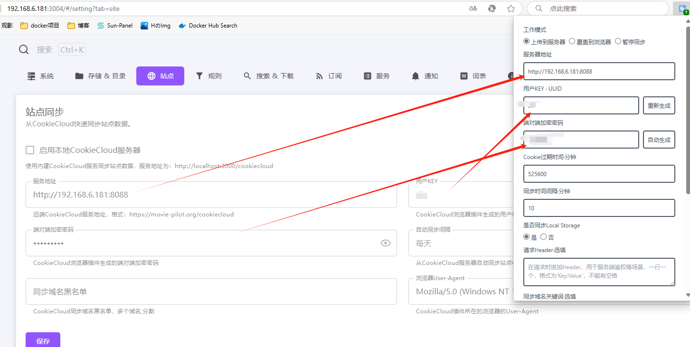

  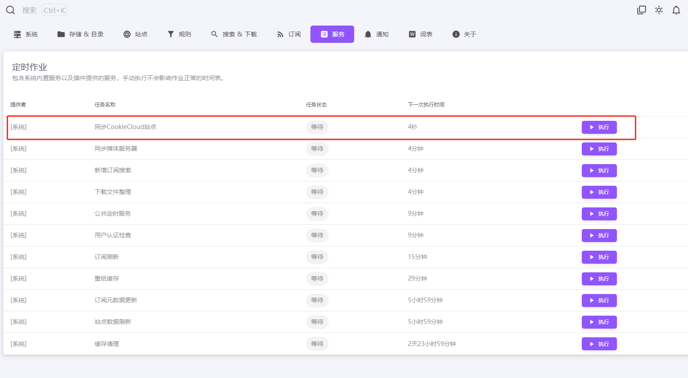

  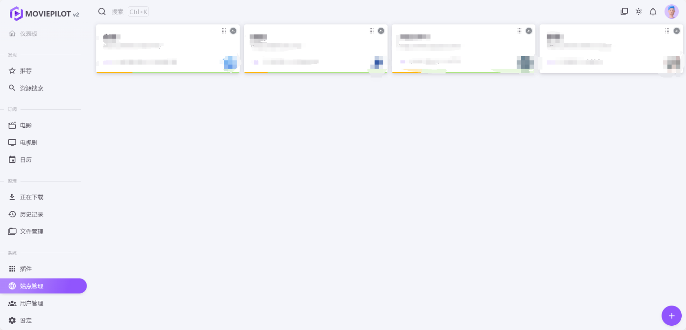

  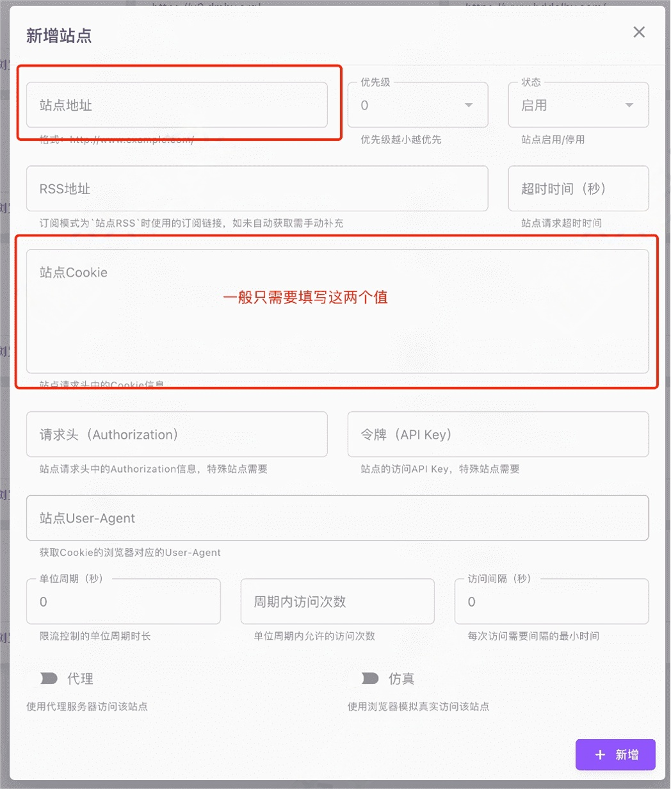

  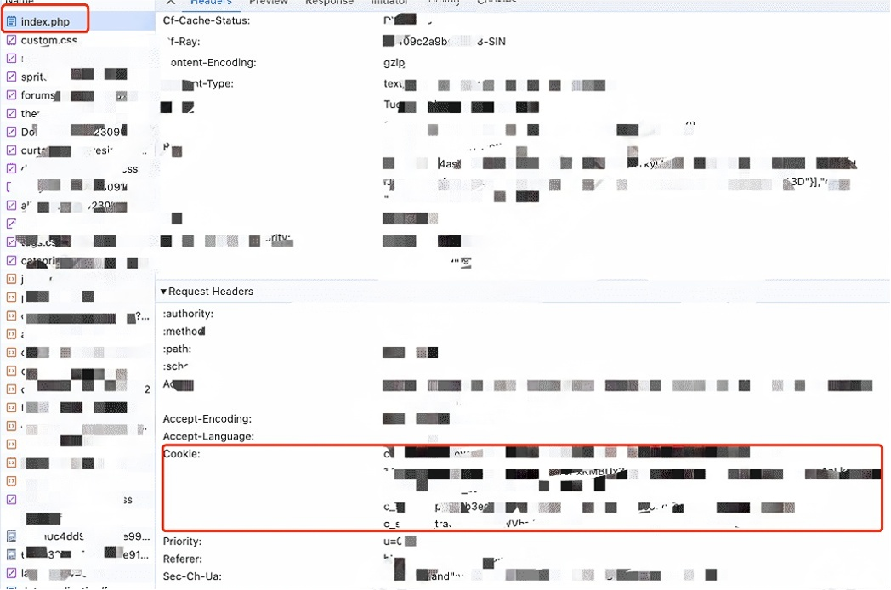

  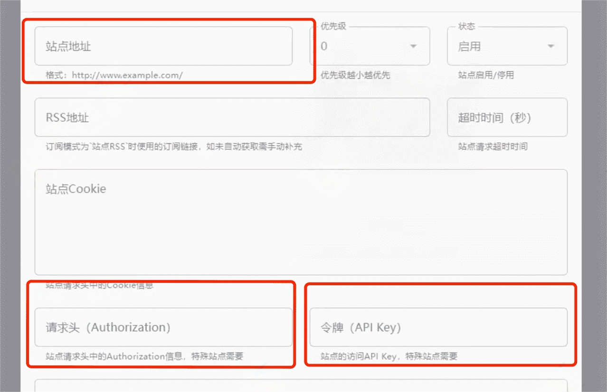

  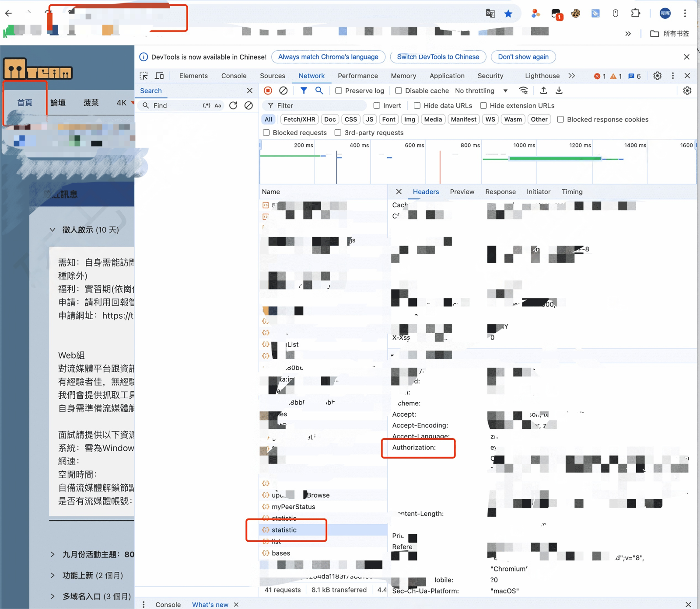

  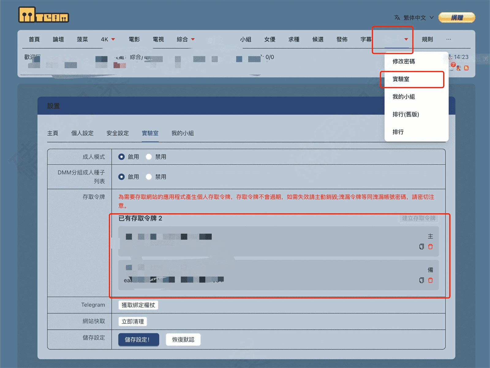


## 规则设置


### 自定义规则（感谢雁窝大佬的分享）


`MoviePilot-V2加入了自定义规则，可以自定义编写用于筛选资源的规则列表，主要用于管理资源的分类和过滤条件。每个条目都有一个id（标识符）、name（名称）、include（包含条件）和exclude（排除条件）等字段。自定义规则列表能帮助用户更加精准、快捷地找到符合偏好的高质量资源，同时保证了筛选的灵活性和效率，让MP的订阅功能得到了史诗级的提升。`

**同时作者还加入了导入、分享功能，方便各位同学直接抄作业。**


### **分享一套自定义规则**


#### **Docker Compose 配置文件**


```
[{"id":"Complete","name":"Complete","include":"(全|共)\\d(集|期)|完结|合集|Complete","exclude":""},{"id":"filterGlobal","name":"filterGlobal","include":"","exclude":"(?i)日语无字|先行|DV|MiniBD|DIY原盘|iPad|UPSCALE|AV1|BDMV|RMVB|DVD|vcd|480p|OPUS","seeders":""},{"id":"filerGroup","name":"filerGroup","include":"","exclude":"(?i)SubsPlease|Up to 21°C|VARYG|TELESYNC|NTb|sGnb|BHYS|DBD|HDH|COLLECTiVE|SRVFI|HDSPad"},{"id":"filterMovie","name":"filterMovie","include":"","exclude":"","seeders":"","size_range":"0-22000"},{"id":"filterSeries","name":"filterSeries","include":"","exclude":"","size_range":"0-102400"},{"id":"AnimeGroup","name":"AnimeGroup","include":"7³ACG|VCB-Studio","exclude":"","size_range":""},{"id":"Audiences","name":"Audiences","include":"ADE|ADWeb","exclude":"","seeders":""},{"id":"HHWEB","name":"HHWEB","include":"HHWEB","exclude":""},{"id":"Crunchyroll","name":"Crunchyroll","include":"CR|Crunchyroll","exclude":""},{"id":"Netflix","name":"Netflix","include":"Netflix|NF","exclude":""},{"id":"B-Global","name":"B-Global","include":"B-Global|BG","exclude":""},{"id":"AMZN","name":"AMZN","include":"AMZN|Amazon","exclude":""},{"id":"HQ","name":"HQ","include":"HQ|高码|EDR","exclude":"","size_range":""},{"id":"DDP","name":"DDP","include":"DDP","exclude":""}]


```


* **Complete：筛选全集或完结资源。include中有匹配“(全|共)\d(集|期)|完结|合集|Complete”内容的条件，表示要包含这些关键词的资源。**
* **filterGlobal：全局过滤器，用于排除不需要的资源。exclude字段包含多种过滤关键词（如“日语无字”、“先行”等），排除与这些关键词匹配的资源。**
* **filerGroup：用于排除不符合要求的小组资源，exclude字段包含多个小组的名称（如“SubsPlease”、“Upto21°C”等）。**
* **filterMovie：电影资源的过滤规则，size\_range字段设置了大小限制为0到22000MB。**
* \*\***filterSeries：剧集资源的过滤规则，size\_range字段设置了大小限制为0到102400MB。**
* **AnimeGroup：特定动漫小组的筛选规则，include字段包含“7³ACG”和“VCB-Studio”等。**
* **Audiences：包含特定观众群体的关键词，如“ADE”和“ADWeb”。**
* **HHWEB：筛选包含“HHWEB”关键字的资源。**
* **Crunchyroll：筛选包含“CR”或“Crunchyroll”关键词的资源。**
* **Netflix：筛选包含“Netflix”或“NF”关键词的资源。**
* **B-Global：筛选包含“B-Global”或“BG”关键词的资源。**
* **AMZN：筛选包含“AMZN”或“Amazon”关键词的资源。**
* **HQ：筛选包含高清资源（“HQ”或“高码”或“EDR”）。**
* **DDP：筛选包含“DDP”关键词的资源。**


### **优先级规则（再次感谢雁窝大佬分享）**


`MoviePilot-V2再次更新了优先级规则的高度自定义，让有动手能力的大佬，可以手搓完美契合自己的订阅规则。本次升级将订阅规则细分至媒体类型（电影、电视剧）与媒体类别（根据你的二级分类而定）。比如我想自定义电影的订阅规则，可以自定义。我还想自定义二级分类下华语电影的订阅规则，同样可以自定义。`


`MPV1的订阅规则是根据设置优先级去匹配你的规则，站点资源命中了该规则就会自动下载。但有优先级匹配会有部分弊端，比如没办法指定追剧定向某个站点小组，必须去订阅管理中手动设置。但电视剧、综艺等，更新勤奋的只有某几个小组，但MP会通过优先级，去下载其他小组资源，导致剧集资源的不统一性。V2进行了全新升级，作者大大真的很厉害。`


### 分享一套优先级规则（基于上面分享的自定义规则）


#### Docker Compose 配置文件


```
[{"name":"前置过滤","rule_string":"filterGlobal& !BLU & !REMUX & !3D & !DOLBY &filerGroup","media_type":"","category":""},{"name":"动画电影","rule_string":" SPECSUB & 4K & BLURAY & H265 > CNSUB & 4K & BLURAY & H265 > CNSUB & 4K & BLURAY > CNSUB & 1080P & BLURAY > CNSUB & 4K > CNSUB & 1080P ","media_type":"电影","category":"动画电影"},{"name":"华语电影","rule_string":" 4K & BLURAY & H265 > 1080P & BLURAY > 4K > 1080P ","media_type":"电影","category":"华语电影"},{"name":"外语电影","rule_string":" SPECSUB & 4K & BLURAY & H265 &filterMovie> CNSUB & 4K & BLURAY & H265 &filterMovie> CNSUB & 1080P & BLURAY &filterMovie> CNSUB & 4K &filterMovie> CNSUB & 1080P &filterMovie","media_type":"电影","category":"外语电影"},{"name":"日番","rule_string":"AnimeGroup& CNSUB & BLURAY & 1080P >Audiences& H265 & BLURAY & 1080P >Audiences&AMZN&HHWEB& CNSUB & 1080P >Audiences&Crunchyroll& CNSUB & 1080P >Audiences&Netflix&HHWEB& CNSUB & 1080P >Audiences&B-Global& 4K & CNSUB >Audiences&B-Global& 1080P & CNSUB >Audiences&HHWEB& CNSUB & 1080P > CNSUB & BLURAY & 1080P > 1080P & CNSUB > 1080P ","media_type":"电视剧","category":"日番"},{"name":"国漫","rule_string":" 4K &Audiences&HHWEB&DDP> 4K &Audiences&HHWEB> 1080P &Audiences&HHWEB> 4K > 1080P > 720P ","media_type":"电视剧","category":"国漫"},{"name":"纪录片","rule_string":" 4K & BLURAY > 1080P & BLURAY > 4K > 1080P ","media_type":"电视剧","category":"纪录片"},{"name":"综艺","rule_string":" 4K & WEBDL &Complete> 4K & WEBDL &HHWEB> WEBDL & 1080P &HHWEB> 4K & WEBDL &Audiences> 1080P &Audiences& WEBDL > 1080P ","media_type":"电视剧","category":"综艺"},{"name":"国产剧","rule_string":" 4K & WEBDL &HQ> 4K & WEBDL > 4K & WEBDL > 1080P > 720P ","media_type":"电视剧","category":"国产剧"},{"name":"欧美剧","rule_string":" SPECSUB & 1080P & BLURAY &filterSeries> 1080P & WEBDL & CNSUB &filterSeries> CNSUB &filterSeries","media_type":"电视剧","category":"欧美剧"},{"name":"日韩剧","rule_string":" SPECSUB & 1080P & BLURAY &filterSeries> CNSUB & 1080P &filterSeries> 1080P & CNSUB &filterSeries> CNSUB &filterSeries ","media_type":"电视剧","category":"日韩剧"},{"name":"现场","rule_string":" CNSUB & 4K > CNSUB & 1080P > 4K > 1080P > !720P ","media_type":"电影","category":"现场"}]


```


* 前置过滤：用于在进行其他筛选之前，排除特定的资源格式。rule\_string包含过滤条件filterGlobal，并排除了“BLU”、“REMUX”、“3D”和“DOLBY”格式，同时排除了小组过滤条件filerGroup。
* 动画电影：针对动画电影的优先规则，按以下顺序选择：
* 有外挂字幕的4K H265蓝光
* 有中文内嵌字幕的4K H265蓝光
* 有中文内嵌字幕的4K蓝光
* 有中文内嵌字幕的1080P蓝光
* 有中文内嵌字幕的4K或1080P
* 华语电影：针对华语电影的优先规则，按以下顺序选择：
* 4K H265蓝光
* 1080P蓝光
* 4K或1080P
* 外语电影：针对外语电影的优先规则，结合filterMovie的条件，按以下顺序选择：
* 有外挂字幕的4K H265蓝光
* 有中文内嵌字幕的4K H265蓝光
* 有中文内嵌字幕的1080P蓝光
* 有中文内嵌字幕的4K或1080P
* 日番：针对日本动漫剧集的优先规则，按以下顺序选择：
* 动漫小组资源，包含中文内嵌字幕的1080P蓝光
* 包含外挂字幕的1080P H265蓝光或来自特定平台的1080P
* 各种平台的4K或1080P
* 国漫：针对中国动漫剧集的优先规则，按以下顺序选择：
* 包含外挂字幕的4K，优先有DDP音轨的资源
* 各种1080P和4K
* 纪录片：针对纪录片资源的优先规则，按以下顺序选择：
* 4K蓝光
* 1080P蓝光
* 各种4K和1080P
* 综艺：针对综艺节目的优先规则，按以下顺序选择：
* 完整的4K WEBDL
* 包含HHWEB或Audiences字幕组的4K或1080P WEBDL
* 国产剧：针对国产电视剧的优先规则，按以下顺序选择：
* 高清4K WEBDL，优先包含HQ的高码率资源
* 各种4K、1080P和720P的WEBDL
* 欧美剧：针对欧美电视剧的优先规则，结合filterSeries的条件，按以下顺序选择：
* 有外挂字幕的1080P蓝光
* 1080P WEBDL，包含中文内嵌字幕
* 其他包含中文内嵌字幕的资源
* 日韩剧：针对日韩电视剧的优先规则，按以下顺序选择：
* 有外挂字幕的1080P蓝光
* 包含中文内嵌字幕的1080P资源
* 现场：针对现场表演或现场记录的资源，按以下顺序选择：
* 中文内嵌字幕的4K或1080P
* 排除720P


**各位大佬可以根据自己的情况进行手动调整，MP-V1的订阅也可以通过手动导入的方式进行添加**


## 下载规则


同样V2相比于V1的站点优先/做种数优先提供了更多的选择，且可以同时进行多种选择，排在前面的优先级越高，未选择的项不纳入排序 


## 搜索&下载


## 订阅


## 订阅流程图


## 词表(再再次感谢雁窝大佬分享）


## 自定义识别词


```yaml
\[Movie\]
episode\.\d{1}
\.(第\d{1,2}集)\. => \1
(?i)Season( *)0?(\d+) => S\2
(?<=SBSUB.*DR.*?)- => part
\[CHS\_CHT\_JP\]\(\w{8}\)
\[CHT\_JP\]\(\w{8}\)
\[CHS\_JP\]\(\w{8}\)
chs&jpn => jpsc
cht&jpn => jptc
\[SBSUB\]\[CONAN\]\[DR => [银色子弹字幕组][名侦探柯南][S01E
\[SBSUB\]\[CONAN\]\[ => [银色子弹字幕组][名侦探柯南][S01E
(?<=VCB-Studio.*?)2nd Season => S02
(?<=VCB-Studio.*?)IV => S04
(?<=VCB-Studio.*?)III => S03
(?<=VCB-Studio.*?)II => S02
[【\[](Fin|END)[】\]]|(?:|\s|\s-\s)(Fin|END)(?=\])|(?<=\d{1,2})_?(Fin|END)
(?<=[\[【].*?(?:组|組|sub|S(?:UB|ub|tudio)|Raw(?:|s)|社)[\]】])(?:(?:\[|【|★|)\d{1,2}月新番(?:\]|】|★|)|)[\[【](.*?)[\]】] => \1
(?<=[\W_])(CR|Baha|KKTV|Abema|B-Global|Sentai|MyVideo|AMZN|KKTV|friDay|DSNP|LINETV|NF|Viu)(?=[\W_]) => -\1
(?i)(CHS|GB|SC)(&|_|＆|\x20)(CHT|BIG5|TC)(&|_|＆|\x20)JA?PN? => 简繁日内封
(?i)(CHS|GB|SC)_JA?PN?(&|＆|\x20)(CHT|BIG5|TC)_JA?PN? => 简繁日内封
(?i)(CHS|GB|SC)(&|＆|\x20)(CHT|BIG5|TC) => 简繁内封
(?i)(CHS|GB|SC)(_|&|＆|\x20)JA?PN? => 简日双语
(?i)\[JA?PN?(_|&|＆|\x20)?(SC|CHS|GB)\] => [简日双语]
(.*)(VCB-Studio)(.*)(Ma10p_?|Hi10p_?)(.*) => \1\2\3\5
S(eason)? ?0?([2-9]) *\[(OVA|OAD)0?\(?(\d)?\)?\] => S0E\2\4
(S(eason)? ?0?1 *)?\[(OVA|OAD)(\d+)?\] => S0E\4
(S(eason)? ?\d+)? *\[\d+\(?(OVA|OAD)\)?\] => S0
(?<=[\W_])4(?:k|K)(?=[\W_]) => 2160p
(?i)\bSBSUB\b => 银色子弹字幕组
(?i)\bNekomoe kisstan\b => 喵萌奶茶屋
(?i)\bOPFansMaplesnow\b => OPFans枫雪动漫
(?i)\bSakurato\b|樱都字幕组|桜都字幕组|桜都 => 桜都字幕组
(?i)\bHaruhana\b => ❀拨雪寻春❀
(?<=[\W_])CR(?=[\W_]) => Crunchyroll
(?<=[\W_])NF(?=[\W_]) => Netflix
(?<=[\W_])AMZN(?=[\W_]) => Amazon
(?<=[\W_])((H?MAX)|ATVP)(?=[\W_]) => -\1
(?<=[\W_])ATVP(?=[\W_]) => AppleTV+
(?<=[\W_])DSNP(?=[\W_]) => Disney+
(?<=(1080p|2160p)\.)Max\. => -MAX.
(?<=(1080p|2160p)\.)iT\. => -iTunes.
(?<!-)(Disney\+|playWEB|Crunchyroll|Netflix|Amazon|AppleTV\+) => -\1


```


## 自定义制作组/字幕组


```yaml
喵萌奶茶屋
风车字幕组
银色子弹字幕组
枫叶字幕组
诸神字幕组
❀拨雪寻春❀
VARYG
AI-Raws
ANi
SweetSub
LoliHouse
VCB-Studio
7³ACG
OPFans枫雪动漫
SilverBullet
APTX4869
Snow-Raws
B-Global
CR
KKTV
Baha
MyVideo
AMZN
KKTV
friDay
Disney+
LINETV
NF
Viu
Crunchyroll
Netflix
Amazon
MAX
AppleTV+
HMAX
BiliBili
Abema
CatchPlay
iTunes
Remux
ADWeb
NTb
FLUX
DSNP
银色子弹字幕组
RLWeb
Breeze@Sunny
Rain@Sunny
RLeaves

```


## 自定义占位符


```yaml
\b(简繁内封|简繁日内封|简繁日英内封|简繁官字内封|官简内封|简日双语|简体内封|简体内嵌|繁体内嵌|简英双语|简繁外挂|简体|HDR|DoVi)\b


```


## 文件整理屏蔽词


```yaml
__\w{6}/
Special Ending Movie
\[((TV|BD|\bBlu-ray\b)?\s*CM\s*\d{2,3})\]
\[Teaser.*?\]
\[PV.*?\]
\[NC[OPED]+.*?\]
\[S\d+\s+Recap(\s+\d+)?\]
Menu
Preview
\b(CDs|SPs|Scans|Bonus|映像特典|映像|specials|特典CD|Menu|Logo|Preview|/mv)\b
\b(NC)?(Disc|片头|OP|OVA|OAD|SP|ED|Advice|Trailer|BDMenu|片尾|PV|CM|Preview|MENU|Info|EDPV|SongSpot|BDSpot)(\d{0,2}|_ALL)\b
WiKi.sample


```


