# PVE虚拟化下安装iStoreOS软路由

## **1、iStoreOS软路由介绍**

iStoreOS (opens new window)是一个开源免费的路由兼存储系统，轻松管理网络与存储，享受一致的操作体验，代码完全开源 

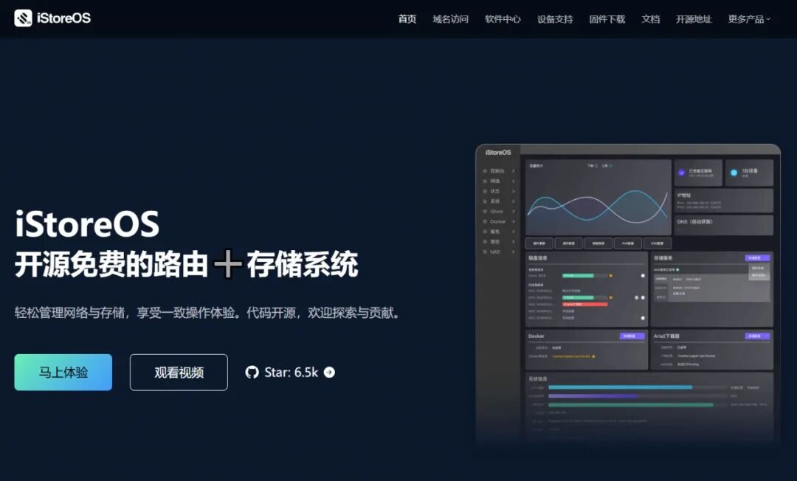


```
https://doc.istoreos.com/zh/guide/istoreos/install_pve.html

```

## **2、下载X86\_64最新固件**


```
https://fw.koolcenter.com/iStoreOS/x86_64/

```

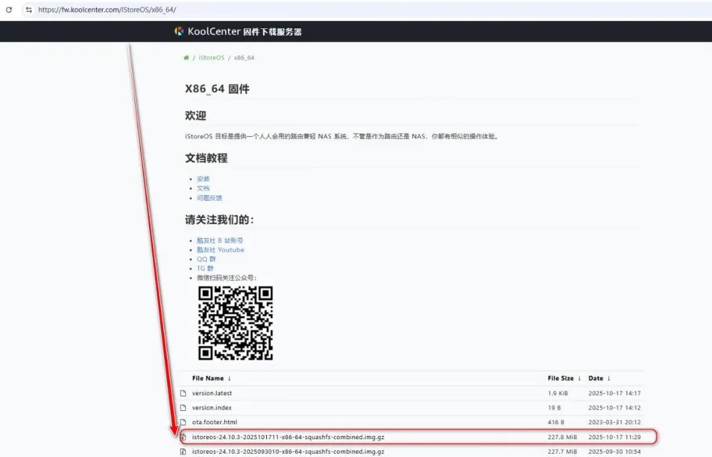

## **3、创建iStoreOS虚拟机**

### **1)名称就叫iStoreOS**

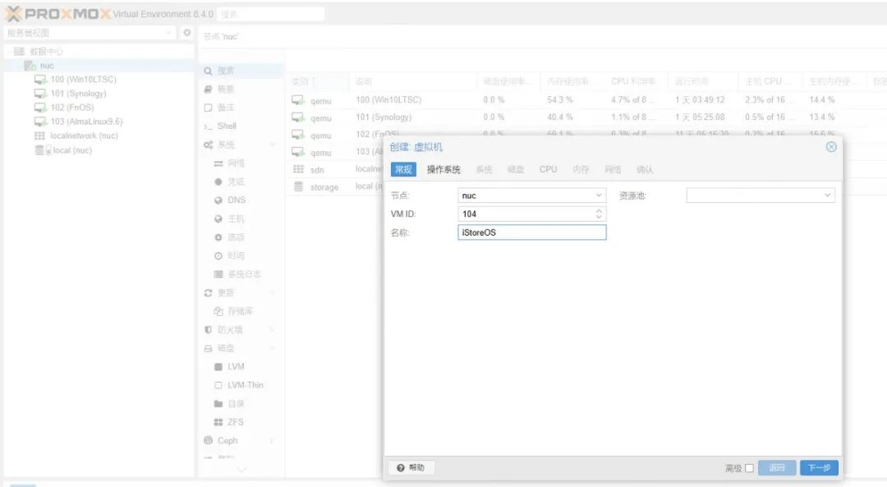

操作系统不使用任何介质 

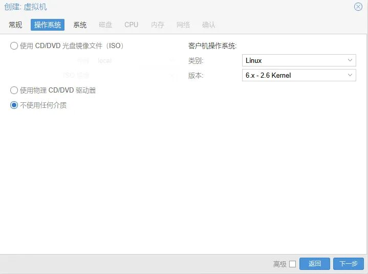

### **2)这里下载的是非EFI固件，此页面不用管，直接下一步；**

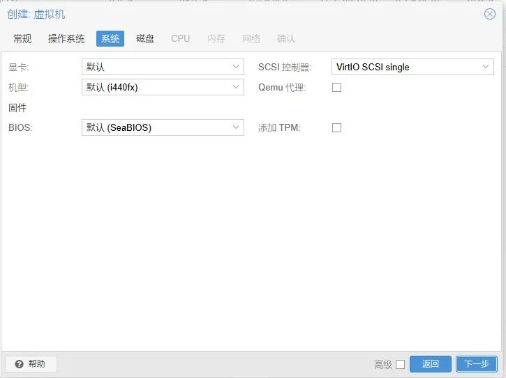

### **3)磁盘设置**

不需要创建，默认的直接删掉，下一步； 

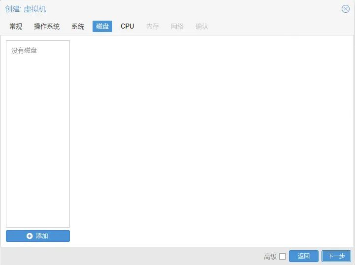

### **4）CPU、内存根据自身资源的大小自行配置**


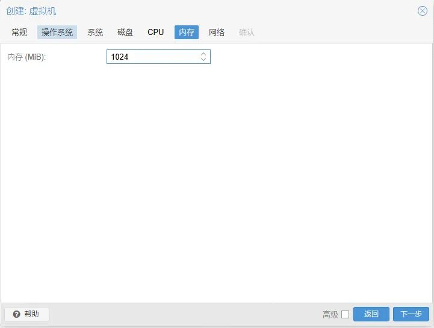

### **5）网络**

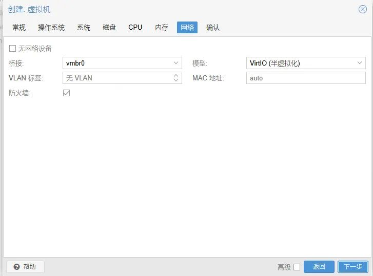

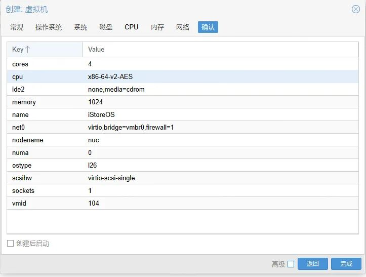

## **4、刚创建的虚拟机里写入固件**

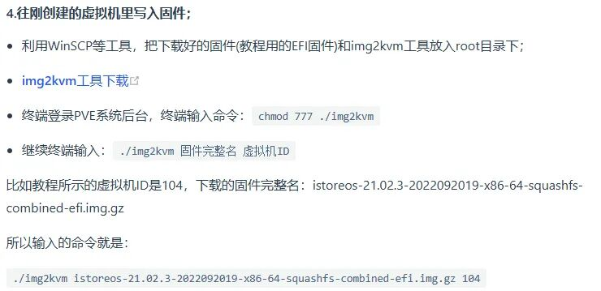

这里需要img2kvm 这个工具

```
wget https://fw0.koolcenter.com/binary/other-tools/img2kvm
chmod 777 img2kvm 

./img2kvm istoreos-24.10.3-2025101711-x86-64-squashfs-combined.img 104 local

```

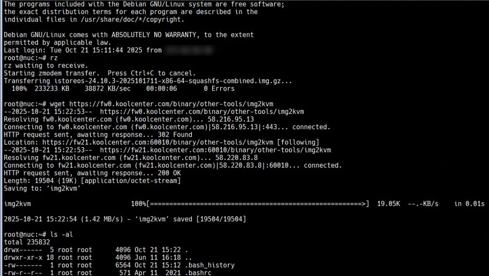


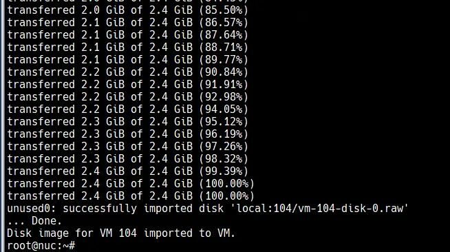

因为我这里的存储池的名字叫local 需要手动指定一下


不用img2kvm：

```
qm importdisk 100 istoreos-24.10.4-2025122612-x86-64-squashfs-combined.img local-lvm

```

## **5、添加磁盘**

PVE虚拟机104的硬件界面，会出现一个未添加的硬盘，双击添加：

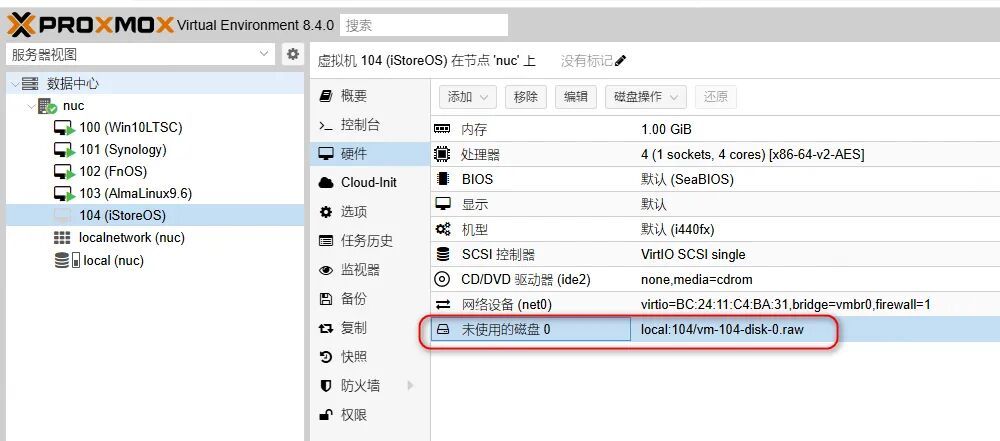

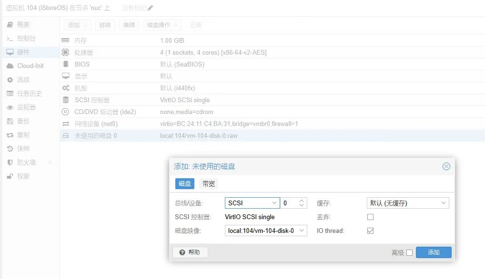

## **6、把刚添加的硬盘作为第一启动**

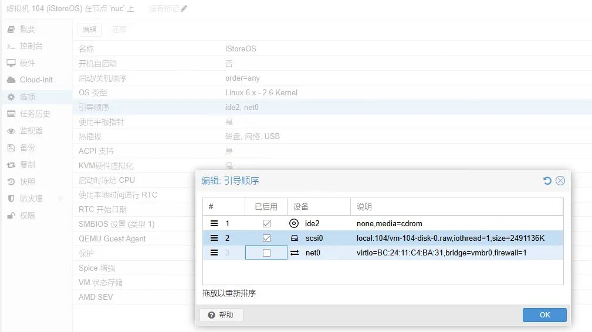

## **7、启动虚拟机**


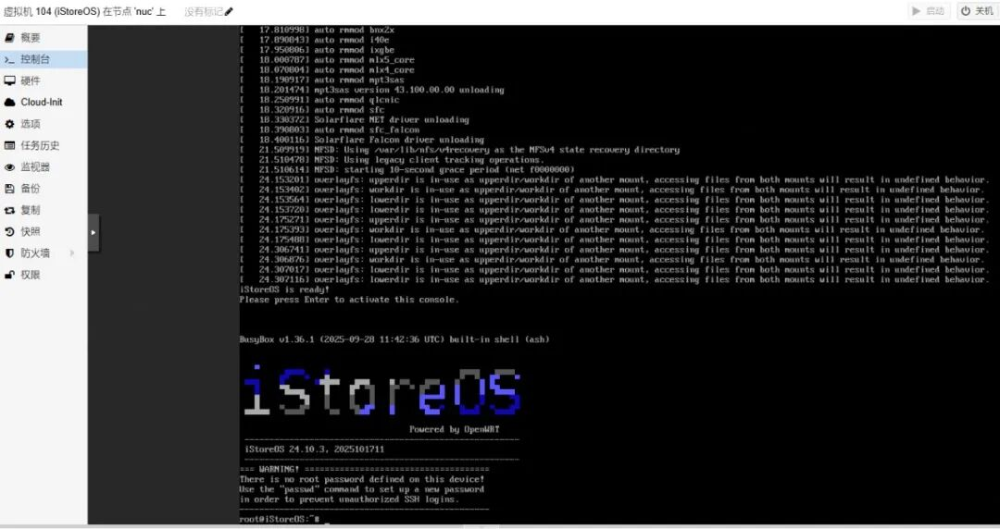

## **8、登陆配置iStoreOS软路由**

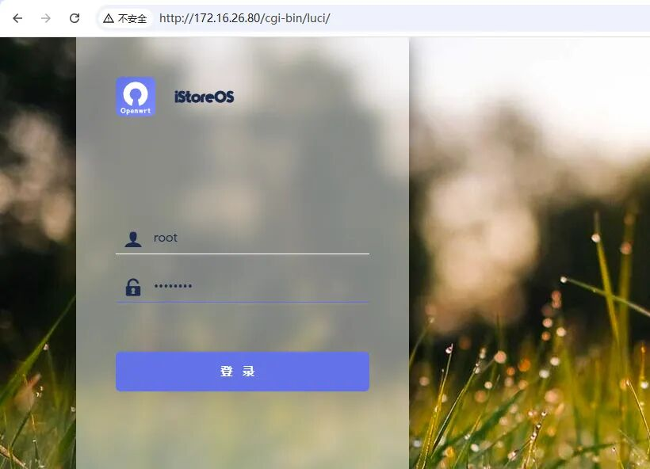

## **9、quickstart命令进行网络配置**

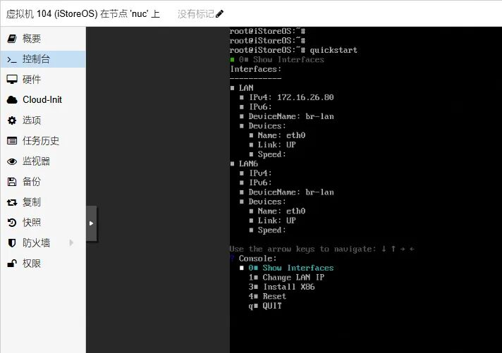

## **10、iStoreOS界面截图**

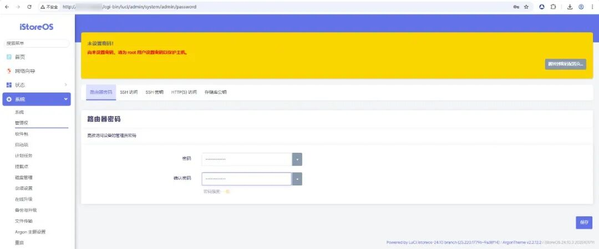

你懂得的工具截图

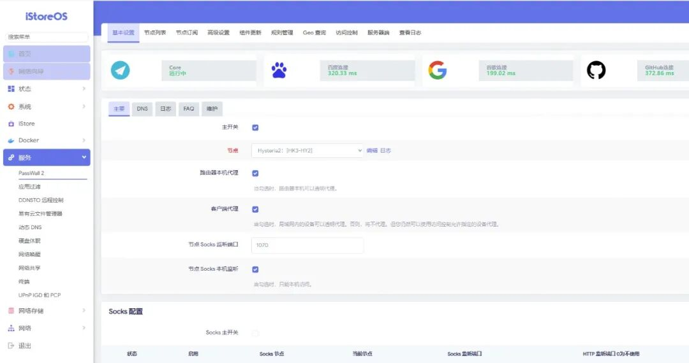
