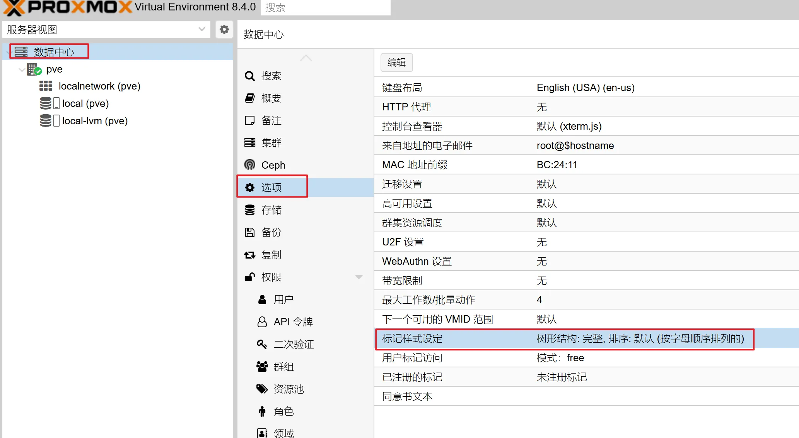
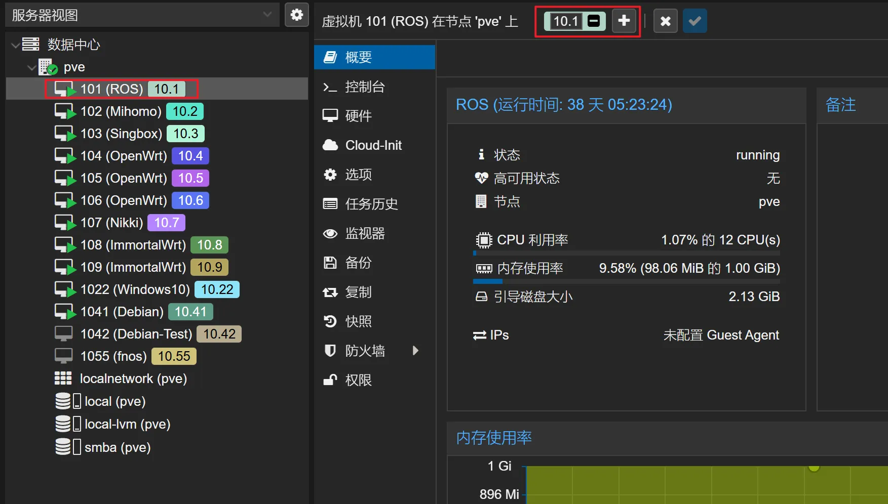

# PVE基础优化设置

[Youtube视频](https://www.qichiyu.com/category/youtube)[软路由](https://www.qichiyu.com/category/softrouter)2025-06-12七尺宇


## 网络设置

有科学网关可指向科学网关，没有就指向主路由

## 软件源设置（debian 源、PVE 源、企业源、ceph 源）

#### 科学环境下源修改

禁用企业源和 Ceph 源，将文件中的内容注释掉（在行前加 `#`）

```
nano /etc/apt/sources.list.d/pve-enterprise.list

```

```
nano /etc/apt/sources.list.d/ceph.list

```

然后执行命令添加非订阅 PVE 源（默认为官方订阅源，免费个人用户需要官方提供的非订阅源才可正常更新 PVE）：

```
echo "deb http://download.proxmox.com/debian/pve bookworm pve-no-subscription" > /etc/apt/sources.list.d/pve-no-subscription.list

```

移除订阅提示pve8.0：

```
sed -i.backup -z "s/res === null || res === undefined || \!res || res\n\t\t\t.data.status.toLowerCase() \!== 'active'/false/g" /usr/share/javascript/proxmox-widget-toolkit/proxmoxlib.js && systemctl restart pveproxy.service
```

移除订阅提示pve9.0（依次执行以下两条命令）：

```
cat <<'EOF' >/etc/apt/apt.conf.d/no-nag-scriptDPkg::Post-Invoke { "dpkg -V proxmox-widget-toolkit | grep -q '/proxmoxlib\.js$'; if [ $? -eq 1 ]; then { echo 'Removing subscription nag from UI...'; sed -i '/.*data\.status.*active/{s/!//;s/active/NoMoreNagging/}' /usr/share/javascript/proxmox-widget-toolkit/proxmoxlib.js; }; fi"; };EOF
```

```
apt --reinstall install proxmox-widget-toolkit && service pveproxy restart
```

#### 直连网络更换国内源

中科大源：

https://mirrors.ustc.edu.cn/help/proxmox.html

清华源：

https://mirrors.tuna.tsinghua.edu.cn/help/proxmox

### 更新 PVE

```
apt updateapt dist-upgrade
```

## 添加CPU、硬盘等详细信息显示

下载脚本

https://github.com/a904055262/PVE-manager-status

上传至root目录，赋予755权限。

然后执行

```
./showtempcpufreq.sh

```

脚本中有移除订阅。

## 开启CPU节能模式

安装必备工具

```
apt install linux-cpupower powertop -y

```

执行以下命令开启高性能或者省电模式

全核高性能

```
cpupower  frequency-set -g performance

```

全核省电

```
cpupower  frequency-set -g powersave

```

0-16 开启高性能

```
cpupower -c 0-15  frequency-set -g  performance

```

切换全核省点模式后重启PVE会自动变回高性能模式，需要再次执行省电命令即可！

## 删除 PVE 多余和未使用内核

查看当前用的内核

```
uname -a

```

查看系统有多少个内核

```
dpkg --get-selections |grep kernel

```

卸载无用内核

```
dpkg --purge --force-remove-essential proxmox-kernel-6.8.12-5-pve-signed

```

把不用的内核删除完成后，更新引导菜单

```
update-grub

```

重启 PVE

清理内核脚本：

https://github.com/jordanhillis/pvekclean

## 虚拟机标示样式：





## 一键优化脚本（常用脚本有老虎和 PVE tools）

https://bbs.x86pi.com/thread?topicId=20

https://github.com/ivanhao/pvetools

* 1 网络设置
* 2 软件源设置（debian 源、PVE 源、企业源、ceph 源）
* 2.1 更新 PVE
* 3 添加CPU、硬盘等详细信息显示
* 4 开启CPU节能模式
* 5 删除 PVE 多余和未使用内核
* 6 虚拟机标示样式：
* 7 一键优化脚本（常用脚本有老虎和 PVE tools）

\------------- Finis ------------- 

自用机场

[PVE](https://www.qichiyu.com/tag/pve)
