# PVE安装

[Youtube视频](https://www.qichiyu.com/category/youtube)[软路由](https://www.qichiyu.com/category/softrouter)2025-06-12七尺宇

## 注意：

> PVE 作为多系统的底层，如果打算长期稳定使用，请首先确认硬件层面的稳定性，比如硬盘质量是否合格，电源是否稳定。

## PVE 安装步骤：

### 1.Pve 安装镜像下载：

1. [官方下载](https://www.proxmox.com/en/downloads)
2. [中国镜像](https://mirror.tuna.tsinghua.edu.cn/proxmox/iso/)

   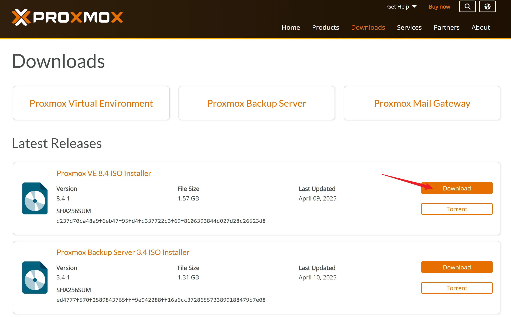

### 2.下载启动 U 盘制作工具：

[Ventoy](https://www.ventoy.net/cn/index.html)

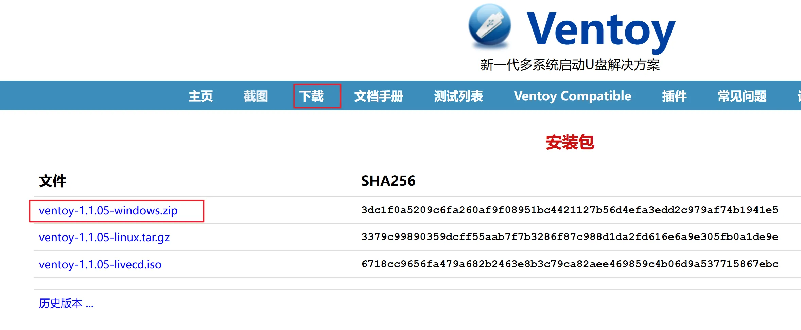

### 3.制作系统安装 U 盘

使用 Ventoy 制作启动U 盘（当然也可以使用 Rufus 等写盘工具），然后把 PVE安装镜像 ISO 文件放入 U 盘根目录即可，当然也可以放入其他的系统镜像。

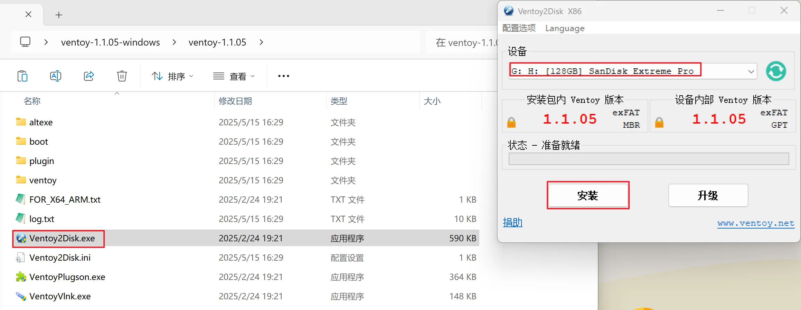

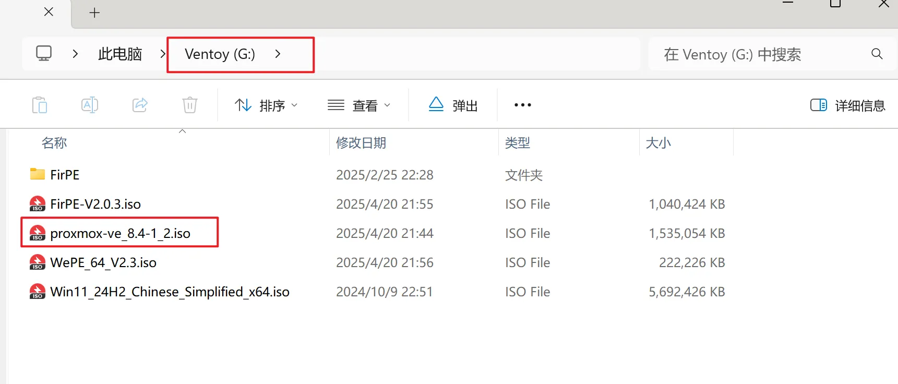

### 4.安装系统

1. 安装主机接入显示器、键盘、鼠标、刚制作的 U 盘插入蓝色 USB 口
2. 设置 BIOS（开启 bios 里的虚拟化支持（Intel CPU 常见名称：`Intel VT`, `Intel Virtualization Technology`, `VT-x`，AMD CPU 常见名称：`SVM Mode`, `AMD-V`, `Secure Virtual Machine`），如需要显卡直通操作同时开启（ `VT-d`, `SR-IOV`, `Above 4GB(如有可以开)`） 因 BIOS 众多无法统一描述，请根据自己主机型号详细搜索相应修改教程），已经设置过则忽略此步
3. 按电源开机，同时不停点按启动热键（自行查询自己主机的快捷热键比如 F 12）
4. 选择制作的 U 盘, 即可进入启动 U 盘的界面

   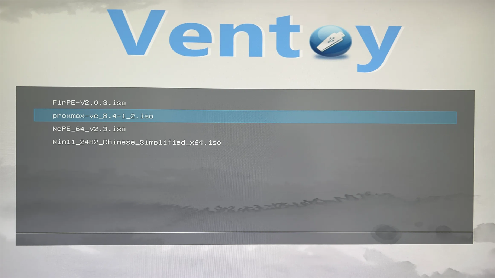
5. 选择 PVE，回车，引导模式再次默认回车

   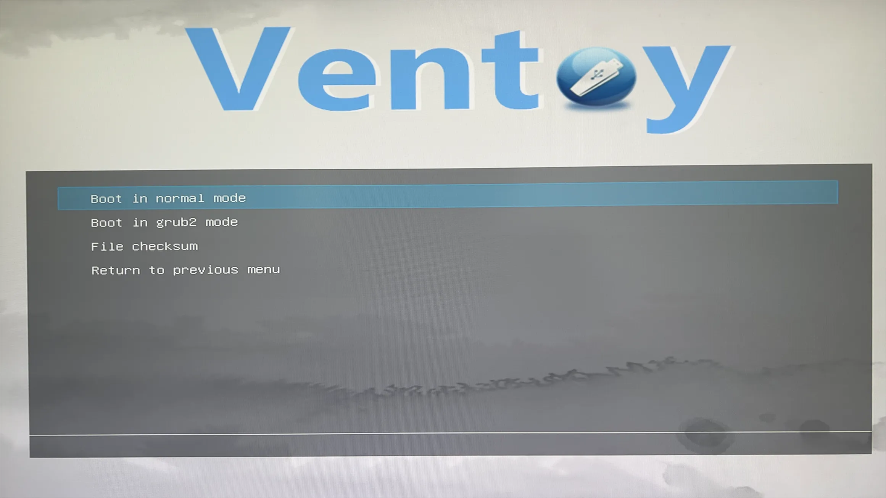
6. 进入 PVE 安装界面，默认回车，然后选择右下角 I Agree

   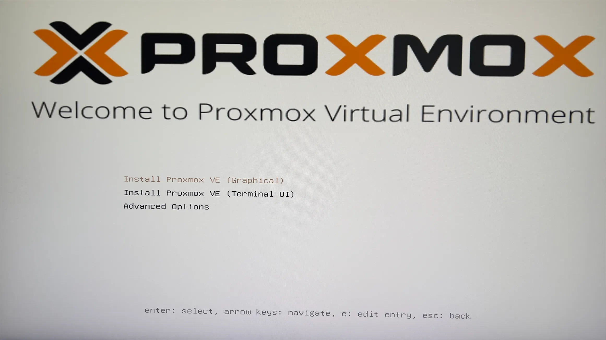
7. 然后选择需要安装 PVE 的硬盘，单击 Options
8. 选择国家时区，输入 china 即可
9. 设置登录密码和邮箱，邮箱无所谓随便填
10. 设置网络信息，网卡选择的管理网卡，保证绿灯亮起，网关、DNS 可以指向科学网关。

    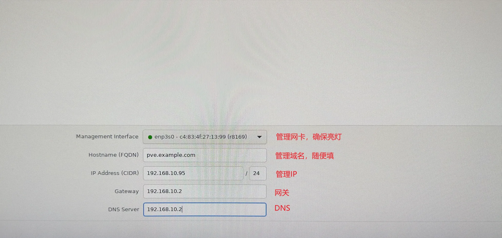
11. 然后点下一步，等待即可安装成功，自动重启后拔下 U 盘即可。
12. 重启后会显示登录信息界面，此时可以拔下显示器鼠标键盘，去电脑登录操作了。

    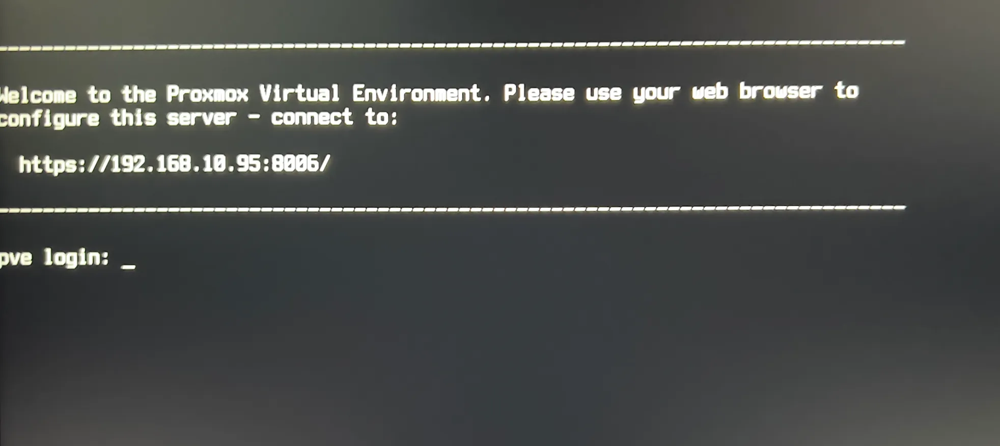
13. 然后浏览器登录管理地址即可，别忘记加端口 8006, 登录用户名 root，密码为安装过程中设置的。
14. 如果无法打开链接，请检查电脑是否和 pve 处于同一网段，只保留管理网线其他网线拔出，还不行， PVE 管理网线直接插在电脑上登录。

    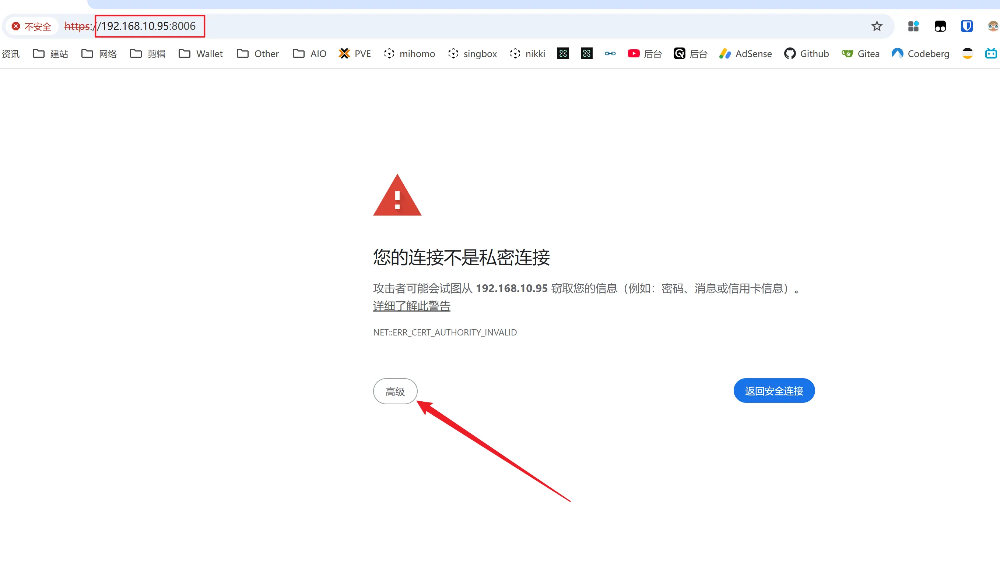

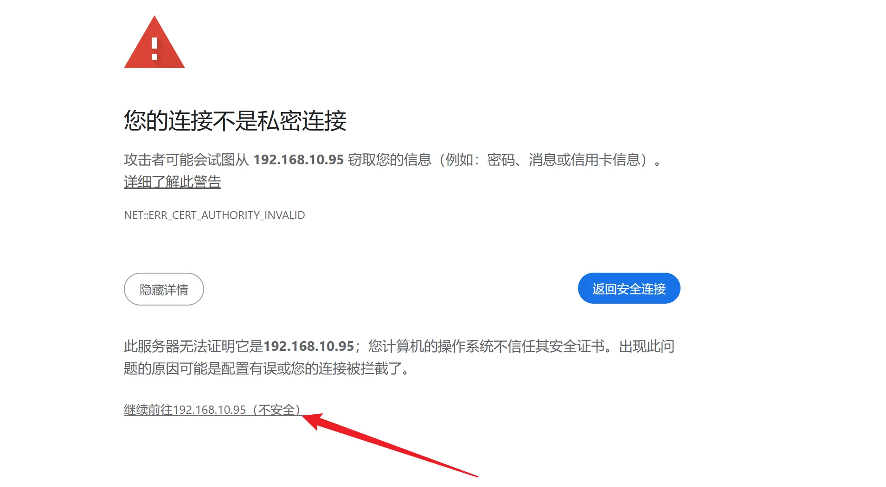

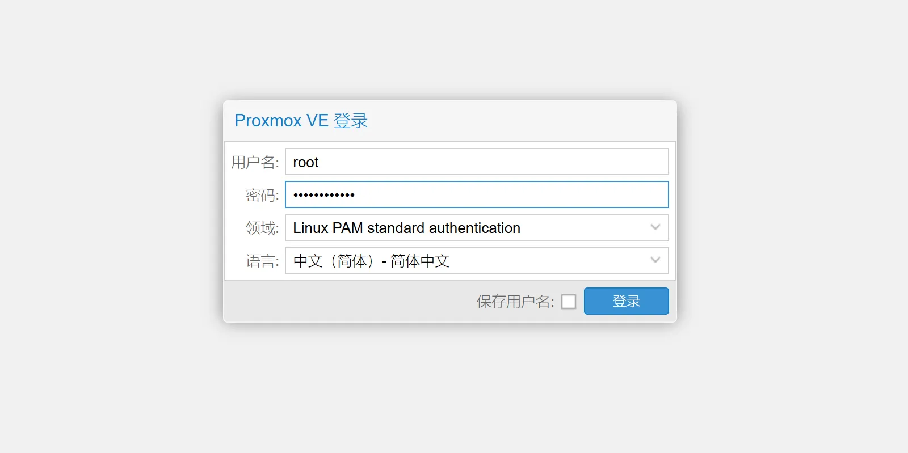

* 1 注意：
* 2 PVE 安装步骤：
* 2.1 1.Pve 安装镜像下载：
* 2.2 2.下载启动 U 盘制作工具：
* 2.3 3.制作系统安装 U 盘
* 2.4 4.安装系统

\------------- Finis ------------- 

自用机场

[PVE](https://www.qichiyu.com/tag/pve)

Copyright © 2026 [七尺宇博客](https://www.qichiyu.com/) All Rights Reserved.

